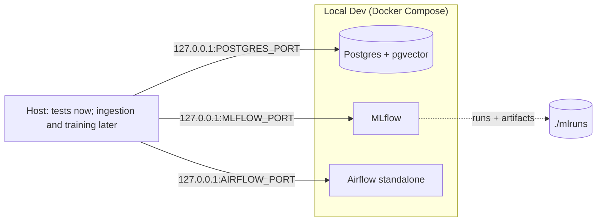

# Zestimator — Dubai Real Estate ML Platform

Portfolio-grade ML platform for Dubai real estate: property price
estimation, duplicate/fraud listing detection, and search ranking, built
on real Dubai Land Department (DLD) transaction data.

> **Status:** Phase 1 (foundation) complete. See
> `docs/superpowers/specs/` for the full 10-phase build plan.

## Architecture (current)



More components (ingestion pipeline, models, FastAPI service, Streamlit
UI) are added in later phases — this diagram grows with them.

## Local development

Prerequisites: Docker Desktop, [uv](https://docs.astral.sh/uv/).

```bash
cp .env.example .env
docker compose up -d --wait
uv sync
uv run pytest tests/ -v
```

`--wait` blocks until all three services report healthy (Airflow takes about a minute on first start). If a local Postgres already uses port 5432, set `POSTGRES_PORT=5433` (or any free port) in `.env` first; likewise set `MLFLOW_PORT` if something already holds 5000 (macOS AirPlay Receiver does by default). All ports bind to 127.0.0.1 only.

| Service | Where (default port — `.env` variable) |
|---|---|
| MLflow | http://localhost:5000 — `MLFLOW_PORT`. Runs and artifacts persist in `./mlruns` |
| Airflow | http://localhost:8080 — `AIRFLOW_PORT`. User `admin`; password via `docker compose exec airflow cat /opt/airflow/standalone_admin_password.txt` (in Git Bash, prefix with `MSYS_NO_PATHCONV=1`) |
| Postgres | `localhost:5432` — `POSTGRES_PORT`. Database, user, and password from `.env` |

## Cost breakdown (current)

| Component | Cost |
|---|---|
| Postgres, MLflow, Airflow (local Docker) | $0 — runs on your machine |

Cloud costs are introduced in Phase 9 (deployment) and documented here as
they're added.

## Module layout

- `ingestion/` — DLD CSV cleaning pipeline (Phase 2)
- `models/` — price/fraud/ranking model code (Phase 3+)
- `api/` — FastAPI service (Phase 6)
- `demo/` — Streamlit app (Phase 7)
- `data/raw/` — drop DLD CSVs here (gitignored)
