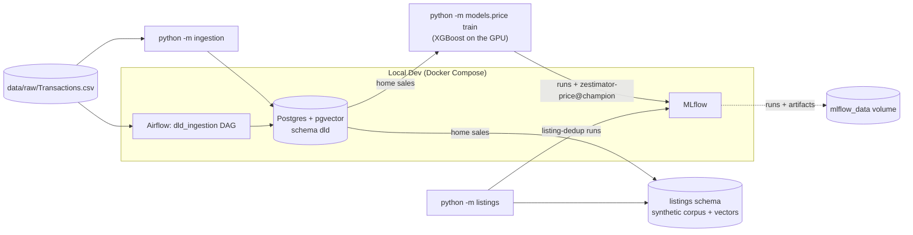

# Zestimator — Dubai Real Estate ML Platform

Portfolio-grade ML platform for Dubai real estate: property price
estimation, duplicate/fraud listing detection, and search ranking, built
on real Dubai Land Department (DLD) transaction data.

> **Status:** Phase 4 (duplicate and fraud detection) complete. See
> `docs/superpowers/specs/` for the full 10-phase build plan.

## Architecture (current)



More components (ingestion pipeline, models, FastAPI service, Streamlit
UI) are added in later phases — this diagram grows with them.

## Local development

Prerequisites: Docker Desktop, [uv](https://docs.astral.sh/uv/).

```bash
cp .env.example .env
docker compose up -d --wait
uv sync
uv run pytest tests/ -v
```

`--wait` blocks until all three services report healthy (Airflow takes about a minute on first start). If a local Postgres already uses port 5432, set `POSTGRES_PORT=5433` (or any free port) in `.env` first; likewise set `MLFLOW_PORT` if something already holds 5000 (macOS AirPlay Receiver does by default). All ports bind to 127.0.0.1 only.

| Service | Where (default port — `.env` variable) |
|---|---|
| MLflow | http://localhost:5000 — `MLFLOW_PORT`. Runs and artifacts persist in the `mlflow_data` Docker volume (not a bind mount — this repo lives on OneDrive, and SQLite over a synced folder stalls 15-20s intermittently) |
| Airflow | http://localhost:8080 — `AIRFLOW_PORT`. User `admin`; password via `docker compose exec airflow cat /opt/airflow/standalone_admin_password.txt` (in Git Bash, prefix with `MSYS_NO_PATHCONV=1`) |
| Postgres | `localhost:5432` — `POSTGRES_PORT`. Database, user, and password from `.env` |

## Data

Real Dubai Land Department transactions (see `data/README.md` for the source).
The file covers **1995-03-07 to 2023-03-17**, so every price estimate in this
project is **as of Q1 2023**. No synthetic data is used in the ingestion phase.

Of 1,047,965 transactions, **707,655** are clean open-market sales used
for modelling. Every other row is kept in Postgres with exactly one exclusion
reason (last full run, 28.9s):

| Reason | Rows | Why excluded |
|---|---:|---|
| `mortgage` | 224,183 | Mortgage registrations aren't sale prices |
| `gift` | 35,890 | Gifts aren't arm's-length prices |
| `non_market_procedure` | 57,241 | Sales-group procedures that aren't open-market sales (lease-to-own, development registration, …) |
| `missing_date` | 0 | No transaction date |
| `missing_price` | 753 | No price |
| `invalid_area` | 0 | Size missing or ≤ 0 |
| `price_below_floor` | 499 | Under AED 10,000 — placeholder or nominal transfer |
| `suspected_sqft_entry` | 2,808 | Price per m² is far too low, but would be normal if the size had been entered in sq ft |
| `price_outlier_low` | 7,873 | Price per m² more than 3.5 robust deviations below comparable sales |
| `price_outlier_high` | 11,063 | Price per m² more than 3.5 robust deviations above comparable sales |
| `duplicate_transaction_id` | 0 | Repeat of an earlier row |

"Comparable sales" means the same area, property type, ready/off-plan status
and year; groups with fewer than 30 sales fall back to wider groups, ending at
citywide by property type.

## Ingestion

```bash
uv run python -m ingestion            # host CLI; reads data/raw/Transactions.csv
docker compose exec airflow airflow dags trigger dld_ingestion   # same pipeline via Airflow (or use the ▶ button in the Airflow UI)
```

Each run replaces the `dld` tables atomically (a failed run leaves the previous
data untouched). Only one run can load at a time — a second concurrent run
stops as soon as it reaches the database, before writing anything — and any
run left marked `running` by a killed process is marked failed as abandoned
by the next run. Each run records itself in
`dld.ingestion_runs` with the file's SHA-256 and per-reason counts. Phase 3
trains on the `dld.market_sales` view. `price_per_sqm_aed`, `price_robust_z`
and `peer_tier` are all derived from the price, so they must never be used as
model features (the columns carry database comments saying so). `dld.area_aliases` maps
familiar names (Dubai Marina, JBR, JLT, JVC, Downtown, …) to DLD's official
area names.

## Price model

Estimates the fair market price of a Dubai home (apartment, hotel apartment,
townhouse or villa) **as of 2023-03-17**, the last date in the DLD data. It
gives an 80% and a 95% price range, and it labels an asking price as below
market, fair or above market. It uses only real DLD transactions; there is no
synthetic data.

```bash
uv run python -m models.price train      # 5–6 min on an RTX 3060 Laptop GPU (60 Optuna trials)
uv run python -m models.price predict --area "JVC" --kind apartment --status ready --size 75 --bedrooms 1 --asking 900000
```

**How it works** (design: `docs/superpowers/specs/2026-09-15-phase3-price-model-design.md`)

- **Data:** homes sold from 2015-01-01 on. Offices, shops, land and whole
  buildings are out of scope. Sizes outside plausible bounds are dropped and
  counted.
- **Split by time:** train up to 2022-06, validate on 2022-07 to 2022-10, and
  test on 2022-11 to 2023-03. The test set is touched once.
- **Target:** ln(price per m²) minus a leak-free market index (the median of
  the previous three months for that segment). Trees can't extrapolate, and
  this keeps the 2022–23 boom from being underpredicted.
- **Off-plan vs ready:** one model for both, with the status as a feature.
  Each of the five segments (unit or villa, off-plan or ready, built-up or
  plot size) gets its own market index, and metrics are reported per segment.
- **Location:** building → project → area → city priors, each shrunk toward
  its parent. A new or sparse location falls back automatically, and the
  response says which level it used. A building given without its project
  still resolves at building level when its name belongs to one project in
  that area.
- **Leakage guards:** an exact feature allowlist, enforced by tests.
  Out-of-fold priors are grouped by bulk sale, so 94 identical sales can't
  reveal each other's price.
- **Model:** XGBoost on the GPU, tuned by Optuna. It is compared against an
  area-comps rule (B0) and LightGBM (B1), and it must beat B0's test MdAPE by
  10% to be registered.
- **Serving:** one MLflow pyfunc, `models:/zestimator-price@champion`.
  - input validation
  - unseen-location fallback
  - clipping of implausible predictions
  - conformal price ranges, calibrated on the test period (below)

**Results** on the test set (2022-11-01 to 2023-03-17, never used for fitting
or tuning). "Honest" adds back the 536 rows that Phase 2's price-based outlier
filter removed.

| Model | MdAPE | PPE10 | PPE20 | MdAPE (honest) |
|---|---|---|---|---|
| B0 comps | 17.3% | 32.3% | 55.1% | 17.7% |
| B1 LightGBM | 13.0% | 39.6% | 67.3% | 13.2% |
| **XGBoost (champion)** | **12.6%** | **41.2%** | **69.1%** | **12.8%** |

The champion clears the gate easily (12.6% against a 15.6% bar, 0.9 × B0), but
it beats LightGBM only narrowly: 0.4 points of MdAPE on the test set. These
are the numbers of `zestimator-price` v2, retrained after the final-review
fixes. The rerun reproduced v1's evaluation metrics exactly. Only the
production refit's trees differ, because GPU training isn't bit-reproducible,
so individual estimates moved by a few percent (for example −3.7% for an
off-plan Dubai Marina flat).

Champion by segment (clean test set). The coverage column measures the
method: ranges calibrated on validation, scored on test. The last column is
the 80% range that ships (next paragraph).

| Segment | Test sales | MdAPE | 80% coverage (val-calibrated) | Shipped 80% range |
|---|---|---|---|---|
| Unit, off-plan, built-up (`unit_off_plan_built_up`) | 19,129 | 10.5% | 72.6% | −20% / +25% |
| Unit, ready, built-up (`unit_ready_built_up`) | 13,180 | 15.4% | 78.5% | −27% / +38% |
| Villa, off-plan, built-up (`villa_off_plan_built_up`) | 3,086 | 13.9% | 67.8% | −24% / +31% |
| Villa, ready, built-up (`villa_ready_built_up`) | 1,100 | 13.4% | 66.0% | −23% / +29% |
| Villa, ready, plot (`villa_ready_plot`) | 1,224 | 17.6% | 66.7% | −31% / +44% |

**Price ranges.** Ranges calibrated on the validation months cover 73.9% of
clean test prices at 80% (target 80%) and 93.5% at 95%; villas fall
furthest short, at 66–68%. The ranges under-cover mainly because validation
also drove early stopping and the 60-trial Optuna search, so its errors are
optimistic (MdAPE 10.6% on validation against 12.6% on test), and the later
months, in the 2022–23 boom, are harder. So the ranges that ship are
calibrated on the test period's errors instead: Nov 2022 to Mar 2023, the
most recent held-out period, which was never used for fitting, tuning or
early stopping. They are wider; the pooled 80% range is −24% / +31% against
−21% / +27% from validation. Their coverage can only be verified once newer
DLD data arrives.

**GPU vs CPU.** On the same three seeded tuning trials, the GPU trained
1,049 boosting rounds in 11.5 s and the CPU 693 rounds in 21.4 s: about
11 ms against 31 ms per round, 2.8× faster on the GPU. Over the full search
the GPU averaged 4.8 s per trial. Tuning adds little on this feature set: 3
CPU trials already reached 12.75% test MdAPE, against 12.60% after 60 GPU
trials.

**Write-up**

*Business problem.* Buyers, sellers and listing platforms need a
defensible fair-value figure for a home, and a way to spot listings priced
far from it. DLD registrations record what homes actually sold for. The model
learns fair value from those sales and flags an asking price outside its 80%
range as below or above market.

*Metric optimised.* Training minimises the weighted squared error of the
relative log price, which is roughly relative error: a 10% miss on an
AED 800k flat counts the same as one on an AED 8M villa. Results are reported
as MdAPE, PPE10 and PPE20, the standard automated-valuation metrics. They're
measured on a later period the model never saw, on both the cleaned test set
and an honest one, because the cleaning rule itself used the price.

*What I'd do differently with production data and traffic.*
- Add unit-level attributes that DLD doesn't publish, such as floor, view and
  condition. They're the biggest missing signal, and listing data would
  supply them.
- Retrain monthly on fresh DLD exports (this data ends in March 2023) and
  watch drift. The market index keeps the price level current between
  retrains, but location premiums move too.
- Make the intervals conditional, for example Mondrian conformal by location
  level, so ranges in sparse areas widen honestly.
- Evaluate against listing-to-sale outcomes, not just registered prices.
- Geocode buildings to use distances instead of area IDs.

## Duplicate and fraud detection

Finds duplicate property listings and suspicious postings using photo and text
similarity, on a **synthetic listings corpus built over real DLD sales**.

**What is real and what is not.** DLD publishes transactions, not listings: no
photos, no descriptions, no agents. So Phase 4 generates 20,000 listings whose
location, building, size, bedrooms and price level come from real 2021–2023 DLD
sales, and whose text, agents, posting dates, duplicates and fraud cases are
invented and labelled. Photos come from the public
[Houses-dataset](https://github.com/emanhamed/Houses-dataset) (535 properties ×
4 rooms; Ahmed & Moustafa, *House Price Estimation from Visual and Textual
Features*, 2016). The images are downloaded, never committed. Every number below
is measured on that synthetic corpus and does not transfer to a real portal.

```bash
uv run python -m listings build                    # 56s: corpus + 3,600 edited photo variants (photos already downloaded)
uv run python -m listings embed                    # 227s on the RTX 3060 (CLIP ViT-B/32 + all-MiniLM-L6-v2), models already cached
uv run python -m listings detect                   # 423s: candidates, scores, duplicate_pairs + fraud_flags
uv run python -m listings evaluate --brute-force   # 568s: metrics against ground truth + the index-vs-exact benchmark, logged to MLflow
```

Those are wall-clock times from the 2026-09-16 re-run (MLflow run
`98a54b9fe60f45a99a36e27c435cd0c1`, experiment `listing-dedup`). Every stage
also writes its own in-process time (a few seconds under the wall-clock
figures above) to `data/listings/stage_timings.json`, and `evaluate`
logs that table as `timings.json` next to the PR curve, the threshold table
(`threshold_table.csv`) and the reporting-split confusion matrix
(`confusion_matrix.json`). A first-ever `build` also downloads the 176 MB photo
archive, and a first-ever `embed` downloads the two models. `detect` and
`evaluate` each spend most of their time pricing all 20,000 listings with the
Phase 3 model.

**What gets planted** (all labelled): 1,200 exact reposts, 900 reworded copies,
900 with cropped/resized/recompressed photos, and 600 bait-priced listings. 300
of the exact reposts carry an asking price shifted by 15–30%. Two kinds of
listing must **not** be flagged:
- *Same-building controls:* 500 groups of three different units in the same
  building, priced within 20% of each other. Half of the groups use one
  developer photo set for all three units, so half of the 1,500 control pairs
  share every photo.
- *Stock-photo controls:* unrelated listings in different areas that share an
  agency photo set.

**How it decides.** Candidates come from three indexed lookups per listing (text
neighbours, image neighbours, and listings sharing an identical photo), never from
comparing all pairs. Each candidate is then scored on twelve signals — text and
photo similarity, shared photos, price and size gaps, same area/building/project,
bedrooms, days apart, same agent — by a logistic regression. The threshold is the
lowest score that reaches 98% precision on the validation split (0.9995 on this
run; validation precision 98.05%), because wrongly accusing a real listing is
worse than missing a repost.

**Results** on the reporting split (the most recent posting dates, never used for
fitting or threshold selection; 213,244 candidate pairs, 814 of them duplicates):

| | Multi-signal model | Photos-only baseline |
|---|---|---|
| Precision | 98.3% | 0.6% |
| Recall (of retrieved duplicates) | 21.1% | 91.0% |
| PR-AUC | 0.889 | — |
| False positives on same-building controls (448 pairs) | 0.0% | 48.9% |
| False positives on stock-photo controls (42,417 pairs) | 0.0% | 99.7% |

The baseline is `image_max_cosine ≥ 0.95` alone. The model made 172 true and 3
false flags. `report.recall` (21.1%) is **conditional on retrieval**: its
denominator is the 814 duplicates that reached the scoring stage. Measured
against all 845 duplicate pairs planted in the reporting split, end-to-end recall
is **20.4%** (172 of 845). This is a high-precision, low-recall detector. It
finds about one planted duplicate in five.

*The false positives.* None of the 3 reporting-split false positives is a
labelled control, yet all 3 are the case the controls are meant to model. Each
pair shares a photo set, the two sizes are almost identical, the prices are
within 2.3% of each other, and text cosine is about 0.98. In two of the pairs,
both listings are reposts of *different* source listings in the same building.
The corpus generator doesn't stop unrelated listings in one building from
drawing the same local photo set, so these pairs are near-duplicates by
construction.

Recall by planted pattern (share of all planted pairs whose later listing falls in
the reporting split, including pairs retrieval never found): exact repost 31.5%
(327 pairs), reworded 4.8% (272), edited photos 22.8% (246). Price-shifted reposts
are never flagged by the duplicate model. Of the reporting-split duplicates with
any price gap between the two listings, 0 of 84 were flagged, against 23.6% of the
730 listed at the same price. The relist flag below catches them instead.
Retrieval recall is 97.1%: the share of planted duplicate pairs that reached the
scoring stage at all. This figure is **pooled** across all splits, because
retrieval runs before any model is fit.

**Why recall is low: how the data was generated.** Four features of the
generator explain most of the weak recall:
- *Missing values count as a mismatch.* `same_building`, `same_project` and
  `bedrooms_equal` score 0 when both listings lack the value. On the previous
  corpus `same_building` carried a positive weight, so a repost of a listing with no building name
  (most villas) looks less like its source than a repost of an apartment does.
- *Recall depends on the repost delay.* Reposts appear 1–30 days after their
  source, and `days_apart` is a model input, so the model has learned that
  window. Late reposts score lower than early ones.
- *Reworded copies look unrelated to the text model.* A reworded copy is a fresh
  description generated from the same facts. Its text similarity to the source
  overlaps the similarity between unrelated listings in the same building. The
  final review measured that overlap on the previous corpus. This is why reworded
  recall is the lowest of the three patterns.
- *Reposts never share an agent.* The generator always gives a repost a
  different agent, so the model learns to count a shared agent against a
  duplicate (`same_agent` weighed −0.43 on the previous corpus; this run's
  coefficients were not re-measured).
  Real reposts by the same agent would look *less* like duplicates to it.

**Why an index and not brute force.** Comparing every pair of 20,000 listings is
200 million comparisons (about 3.2 billion at photo level). `evaluate
--brute-force` compares like with like: the indexed (HNSW) text lookup against
the same top-20 text query run as an exact, index-disabled sequential scan over
the whole corpus. The indexed text lookup took 7.9s and the exact text scan
156.1s. The indexed text channel returned 99.4% of the 256,452 exact
text-neighbour pairs. All three indexed lookups together took 15.8s for 598,533
candidate pairs.

**Fraud flags.**
- **`bait_price`** asks the Phase 3 price model (registry version 2, logged as
  `price_model_version`) what the home is worth. It flags asking prices more
  than 10% below the model's 80% range.
  - *Results:* precision 45.2%, recall 96.5% against the planted cases. There
    are 706 labelled listings: the 600 planted plus 106 reposts of them.
    1,508 were flagged, and 17 of the 20,000 listings could not be priced.
  - *These numbers are in-sample for the price model, so they are
    optimistic.* The champion was refit on all the data, which covers every
    source sale (2021-01-03 to 2023-03-17). It has therefore already seen
    each base listing's real sale price and its building's comparable sales.
    On unseen data it would likely flag more normal listings.
  - Roughly half its flags land on listings that were not planted as bait,
    so it is a review-queue signal, not a verdict.
- **`photo_reuse`** flags a photo set used in 5 or more areas (4,901 listings).
- **`inconsistent_relist`** flags duplicate clusters whose asking prices differ
  by more than 20%.
  - *Decision:* it uses a **price-blind** duplicate decision: the same fitted
    model and threshold, with the price gap set to 0 before scoring (965 pairs,
    against 754 for the headline decision). The headline decision penalises a
    price gap, so it never flags a relist.
  - *Truth:* listings in planted duplicate groups whose asking prices differ by
    more than 20%.
  - *Results:* 291 listings flagged. On the reporting-split listings (the same
    date cut), precision is 90.8% (65 flagged) and recall is 56.2% (of 105).

If the price model cannot be loaded, `bait_price` is skipped and the other flags
still run.

**Write-up**

*Business problem.* Duplicate and fraudulent listings waste buyers' time and
damage a portal's credibility. The cost of a wrong accusation is high, so the
system is tuned for precision and every flag records the evidence behind it in
`listings.duplicate_pairs.signals` and `listings.fraud_flags.detail`, ready for a
review queue.

*Metric optimised.* Precision first (a floor of 98% chosen on the validation
split), with recall reported at that bar, plus the false-positive rate on the two
control groups — the cases a naive photo-similarity rule gets wrong. The honest
result is a high-precision, low-recall detector. It beats the photo rule by a
wide margin on both controls: 0.0% against 48.9% and 99.7%. But it finds only
about one planted duplicate in five, and almost none of the reworded copies. A
price-shifted repost is left to the relist flag.

*What I would do differently with real listings.* Real duplicate labels do not
exist, so I would:
- bootstrap labels from agent-reported duplicates and moderator actions, and
  treat them as noisy positives;
- add watermark and logo detection, which real agency photos carry;
- use ANN over photo embeddings with a fanout cap per photo once stock photos
  are identified;
- re-check the threshold per market segment, since a luxury villa repost and a
  studio repost do not carry the same cost.

On this corpus the next fixes are:
- drop `days_apart` and `same_agent` as model inputs, since they encode how the
  generator works rather than what a repost is;
- treat a pair of missing values as unknown rather than as a mismatch;
- add a text signal that survives rewording, such as matching on extracted
  facts.

## Cost breakdown (current)

| Component | Cost |
|---|---|
| Postgres, MLflow, Airflow (local Docker) | $0 — runs on your machine |
| Price model training (local RTX 3060) | $0 — runs on your machine |
| Photo dataset + embedding models (one-off download) | $0 — about 0.8 GB on disk |

Cloud costs are introduced in Phase 9 (deployment) and documented here as
they're added.

## Module layout

- `ingestion/` — DLD CSV validation, cleaning, and Postgres load (`python -m ingestion`)
- `dags/` — Airflow DAGs (`dld_ingestion`)
- `scripts/` — maintenance scripts (test-fixture builder)
- `models/price/` — home price model: features, training, evaluation, predictor (`python -m models.price`)
- `listings/` — synthetic listings corpus, duplicate detection, fraud flags (`python -m listings`)
- `api/` — FastAPI service (Phase 6)
- `demo/` — Streamlit app (Phase 7)
- `data/raw/` — drop DLD CSVs here (gitignored)
