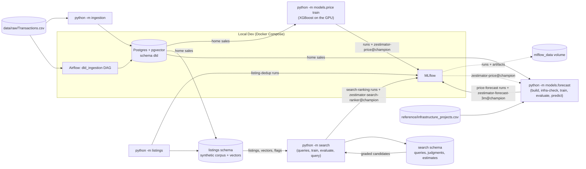

# Zestimator — Dubai Real Estate ML Platform

Portfolio-grade ML platform for Dubai real estate: property price
estimation, duplicate/fraud listing detection, and search ranking, built
on real Dubai Land Department (DLD) transaction data.

> **Status:** Phase 6 (multi-horizon price forecasting) complete — the 3-month
> horizon is deployed; 1-year and 3-year did not clear their gates (see
> "Price forecasting" below). See `docs/superpowers/specs/` for the full
> build plan (11 phases).

## Architecture (current)



More components (ingestion pipeline, models, FastAPI service, Streamlit
UI) are added in later phases — this diagram grows with them.

## Local development

Prerequisites: Docker Desktop, [uv](https://docs.astral.sh/uv/).

```bash
cp .env.example .env
docker compose up -d --wait
uv sync
uv run pytest tests/ -v
```

`--wait` blocks until all three services report healthy (Airflow takes about a minute on first start). If a local Postgres already uses port 5432, set `POSTGRES_PORT=5433` (or any free port) in `.env` first; likewise set `MLFLOW_PORT` if something already holds 5000 (macOS AirPlay Receiver does by default). All ports bind to 127.0.0.1 only.

| Service | Where (default port — `.env` variable) |
|---|---|
| MLflow | http://localhost:5000 — `MLFLOW_PORT`. Runs and artifacts persist in the `mlflow_data` Docker volume (not a bind mount — this repo lives on OneDrive, and SQLite over a synced folder stalls 15-20s intermittently) |
| Airflow | http://localhost:8080 — `AIRFLOW_PORT`. User `admin`; password via `docker compose exec airflow cat /opt/airflow/standalone_admin_password.txt` (in Git Bash, prefix with `MSYS_NO_PATHCONV=1`) |
| Postgres | `localhost:5432` — `POSTGRES_PORT`. Database, user, and password from `.env` |

## Data

Real Dubai Land Department transactions (see `data/README.md` for the source).
The file covers **1995-03-07 to 2023-03-17**, so every price estimate in this
project is **as of Q1 2023**. No synthetic data is used in the ingestion phase.

Of 1,047,965 transactions, **707,655** are clean open-market sales used
for modelling. Every other row is kept in Postgres with exactly one exclusion
reason (last full run, 28.9s):

| Reason | Rows | Why excluded |
|---|---:|---|
| `mortgage` | 224,183 | Mortgage registrations aren't sale prices |
| `gift` | 35,890 | Gifts aren't arm's-length prices |
| `non_market_procedure` | 57,241 | Sales-group procedures that aren't open-market sales (lease-to-own, development registration, …) |
| `missing_date` | 0 | No transaction date |
| `missing_price` | 753 | No price |
| `invalid_area` | 0 | Size missing or ≤ 0 |
| `price_below_floor` | 499 | Under AED 10,000 — placeholder or nominal transfer |
| `suspected_sqft_entry` | 2,808 | Price per m² is far too low, but would be normal if the size had been entered in sq ft |
| `price_outlier_low` | 7,873 | Price per m² more than 3.5 robust deviations below comparable sales |
| `price_outlier_high` | 11,063 | Price per m² more than 3.5 robust deviations above comparable sales |
| `duplicate_transaction_id` | 0 | Repeat of an earlier row |

"Comparable sales" means the same area, property type, ready/off-plan status
and year; groups with fewer than 30 sales fall back to wider groups, ending at
citywide by property type.

## Ingestion

```bash
uv run python -m ingestion            # host CLI; reads data/raw/Transactions.csv
docker compose exec airflow airflow dags trigger dld_ingestion   # same pipeline via Airflow (or use the ▶ button in the Airflow UI)
```

Each run replaces the `dld` tables atomically (a failed run leaves the previous
data untouched). Only one run can load at a time — a second concurrent run
stops as soon as it reaches the database, before writing anything — and any
run left marked `running` by a killed process is marked failed as abandoned
by the next run. Each run records itself in
`dld.ingestion_runs` with the file's SHA-256 and per-reason counts. Phase 3
trains on the `dld.market_sales` view. `price_per_sqm_aed`, `price_robust_z`
and `peer_tier` are all derived from the price, so they must never be used as
model features (the columns carry database comments saying so). `dld.area_aliases` maps
familiar names (Dubai Marina, JBR, JLT, JVC, Downtown, …) to DLD's official
area names.

## Price model

Estimates the fair market price of a Dubai home (apartment, hotel apartment,
townhouse or villa) **as of 2023-03-17**, the last date in the DLD data. It
gives an 80% and a 95% price range, and it labels an asking price as below
market, fair or above market. It uses only real DLD transactions; there is no
synthetic data.

```bash
uv run python -m models.price train      # 5–6 min on an RTX 3060 Laptop GPU (60 Optuna trials)
uv run python -m models.price predict --area "JVC" --kind apartment --status ready --size 75 --bedrooms 1 --asking 900000
```

**How it works** (design: `docs/superpowers/specs/2026-09-15-phase3-price-model-design.md`)

- **Data:** homes sold from 2015-01-01 on. Offices, shops, land and whole
  buildings are out of scope. Sizes outside plausible bounds are dropped and
  counted.
- **Split by time:** train up to 2022-06, validate on 2022-07 to 2022-10, and
  test on 2022-11 to 2023-03. The test set is touched once.
- **Target:** ln(price per m²) minus a leak-free market index (the median of
  the previous three months for that segment). Trees can't extrapolate, and
  this keeps the 2022–23 boom from being underpredicted.
- **Off-plan vs ready:** one model for both, with the status as a feature.
  Each of the five segments (unit or villa, off-plan or ready, built-up or
  plot size) gets its own market index, and metrics are reported per segment.
- **Location:** building → project → area → city priors, each shrunk toward
  its parent. A new or sparse location falls back automatically, and the
  response says which level it used. A building given without its project
  still resolves at building level when its name belongs to one project in
  that area.
- **Leakage guards:** an exact feature allowlist, enforced by tests.
  Out-of-fold priors are grouped by bulk sale, so 94 identical sales can't
  reveal each other's price.
- **Model:** XGBoost on the GPU, tuned by Optuna. It is compared against an
  area-comps rule (B0) and LightGBM (B1), and it must beat B0's test MdAPE by
  10% to be registered.
- **Serving:** one MLflow pyfunc, `models:/zestimator-price@champion`.
  - input validation
  - unseen-location fallback
  - clipping of implausible predictions
  - conformal price ranges, calibrated on the test period (below)

**Results** on the test set (2022-11-01 to 2023-03-17, never used for fitting
or tuning). "Honest" adds back the 536 rows that Phase 2's price-based outlier
filter removed.

| Model | MdAPE | PPE10 | PPE20 | MdAPE (honest) |
|---|---|---|---|---|
| B0 comps | 17.3% | 32.3% | 55.1% | 17.7% |
| B1 LightGBM | 13.0% | 39.6% | 67.3% | 13.2% |
| **XGBoost (champion)** | **12.6%** | **41.2%** | **69.1%** | **12.8%** |

The champion clears the gate easily (12.6% against a 15.6% bar, 0.9 × B0), but
it beats LightGBM only narrowly: 0.4 points of MdAPE on the test set. These
are the numbers of `zestimator-price` v2, retrained after the final-review
fixes. The rerun reproduced v1's evaluation metrics exactly. Only the
production refit's trees differ, because GPU training isn't bit-reproducible,
so individual estimates moved by a few percent (for example −3.7% for an
off-plan Dubai Marina flat).

Champion by segment (clean test set). The coverage column measures the
method: ranges calibrated on validation, scored on test. The last column is
the 80% range that ships (next paragraph).

| Segment | Test sales | MdAPE | 80% coverage (val-calibrated) | Shipped 80% range |
|---|---|---|---|---|
| Unit, off-plan, built-up (`unit_off_plan_built_up`) | 19,129 | 10.5% | 72.6% | −20% / +25% |
| Unit, ready, built-up (`unit_ready_built_up`) | 13,180 | 15.4% | 78.5% | −27% / +38% |
| Villa, off-plan, built-up (`villa_off_plan_built_up`) | 3,086 | 13.9% | 67.8% | −24% / +31% |
| Villa, ready, built-up (`villa_ready_built_up`) | 1,100 | 13.4% | 66.0% | −23% / +29% |
| Villa, ready, plot (`villa_ready_plot`) | 1,224 | 17.6% | 66.7% | −31% / +44% |

**Price ranges.** Ranges calibrated on the validation months cover 73.9% of
clean test prices at 80% (target 80%) and 93.5% at 95%; villas fall
furthest short, at 66–68%. The ranges under-cover mainly because validation
also drove early stopping and the 60-trial Optuna search, so its errors are
optimistic (MdAPE 10.6% on validation against 12.6% on test), and the later
months, in the 2022–23 boom, are harder. So the ranges that ship are
calibrated on the test period's errors instead: Nov 2022 to Mar 2023, the
most recent held-out period, which was never used for fitting, tuning or
early stopping. They are wider; the pooled 80% range is −24% / +31% against
−21% / +27% from validation. Their coverage can only be verified once newer
DLD data arrives.

**GPU vs CPU.** On the same three seeded tuning trials, the GPU trained
1,049 boosting rounds in 11.5 s and the CPU 693 rounds in 21.4 s: about
11 ms against 31 ms per round, 2.8× faster on the GPU. Over the full search
the GPU averaged 4.8 s per trial. Tuning adds little on this feature set: 3
CPU trials already reached 12.75% test MdAPE, against 12.60% after 60 GPU
trials.

**Write-up**

*Business problem.* Buyers, sellers and listing platforms need a
defensible fair-value figure for a home, and a way to spot listings priced
far from it. DLD registrations record what homes actually sold for. The model
learns fair value from those sales and flags an asking price outside its 80%
range as below or above market.

*Metric optimised.* Training minimises the weighted squared error of the
relative log price, which is roughly relative error: a 10% miss on an
AED 800k flat counts the same as one on an AED 8M villa. Results are reported
as MdAPE, PPE10 and PPE20, the standard automated-valuation metrics. They're
measured on a later period the model never saw, on both the cleaned test set
and an honest one, because the cleaning rule itself used the price.

*What I'd do differently with production data and traffic.*
- Add unit-level attributes that DLD doesn't publish, such as floor, view and
  condition. They're the biggest missing signal, and listing data would
  supply them.
- Retrain monthly on fresh DLD exports (this data ends in March 2023) and
  watch drift. The market index keeps the price level current between
  retrains, but location premiums move too.
- Make the intervals conditional, for example Mondrian conformal by location
  level, so ranges in sparse areas widen honestly.
- Evaluate against listing-to-sale outcomes, not just registered prices.
- Geocode buildings to use distances instead of area IDs.

## Duplicate and fraud detection

Finds duplicate property listings and suspicious postings using photo and text
similarity, on a **synthetic listings corpus built over real DLD sales**.

**What is real and what is not.** DLD publishes transactions, not listings: no
photos, no descriptions, no agents. So Phase 4 generates 20,000 listings whose
location, building, size, bedrooms and price level come from real 2021–2023 DLD
sales, and whose text, agents, posting dates, duplicates and fraud cases are
invented and labelled. Photos come from the public
[Houses-dataset](https://github.com/emanhamed/Houses-dataset) (535 properties ×
4 rooms; Ahmed & Moustafa, *House Price Estimation from Visual and Textual
Features*, 2016). The images are downloaded, never committed. Every number below
is measured on that synthetic corpus and does not transfer to a real portal.

```bash
uv run python -m listings build                    # 56s: corpus + 3,600 edited photo variants (photos already downloaded)
uv run python -m listings embed                    # 227s on the RTX 3060 (CLIP ViT-B/32 + all-MiniLM-L6-v2), models already cached
uv run python -m listings detect                   # 423s: candidates, scores, duplicate_pairs + fraud_flags
uv run python -m listings evaluate --brute-force   # 568s: metrics against ground truth + the index-vs-exact benchmark, logged to MLflow
```

Those are wall-clock times from the 2026-09-16 re-run (MLflow run
`98a54b9fe60f45a99a36e27c435cd0c1`, experiment `listing-dedup`). Every stage
also writes its own in-process time (a few seconds under the wall-clock
figures above) to `data/listings/stage_timings.json`, and `evaluate`
logs that table as `timings.json` next to the PR curve, the threshold table
(`threshold_table.csv`) and the reporting-split confusion matrix
(`confusion_matrix.json`). A first-ever `build` also downloads the 176 MB photo
archive, and a first-ever `embed` downloads the two models. `detect` and
`evaluate` each spend most of their time pricing all 20,000 listings with the
Phase 3 model.

**What gets planted** (all labelled): 1,200 exact reposts, 900 reworded copies,
900 with cropped/resized/recompressed photos, and 600 bait-priced listings. 300
of the exact reposts carry an asking price shifted by 15–30%. Two kinds of
listing must **not** be flagged:
- *Same-building controls:* 500 groups of three different units in the same
  building, priced within 20% of each other. Half of the groups use one
  developer photo set for all three units, so half of the 1,500 control pairs
  share every photo.
- *Stock-photo controls:* unrelated listings in different areas that share an
  agency photo set.

**How it decides.** Candidates come from three indexed lookups per listing (text
neighbours, image neighbours, and listings sharing an identical photo), never from
comparing all pairs. Each candidate is then scored on twelve signals — text and
photo similarity, shared photos, price and size gaps, same area/building/project,
bedrooms, days apart, same agent — by a logistic regression. The threshold is the
lowest score that reaches 98% precision on the validation split (0.9995 on this
run; validation precision 98.05%), because wrongly accusing a real listing is
worse than missing a repost.

**Results** on the reporting split (the most recent posting dates, never used for
fitting or threshold selection; 213,244 candidate pairs, 814 of them duplicates):

| | Multi-signal model | Photos-only baseline |
|---|---|---|
| Precision | 98.3% | 0.6% |
| Recall (of retrieved duplicates) | 21.1% | 91.0% |
| PR-AUC | 0.889 | — |
| False positives on same-building controls (448 pairs) | 0.0% | 48.9% |
| False positives on stock-photo controls (42,417 pairs) | 0.0% | 99.7% |

The baseline is `image_max_cosine ≥ 0.95` alone. The model made 172 true and 3
false flags. `report.recall` (21.1%) is **conditional on retrieval**: its
denominator is the 814 duplicates that reached the scoring stage. Measured
against all 845 duplicate pairs planted in the reporting split, end-to-end recall
is **20.4%** (172 of 845). This is a high-precision, low-recall detector. It
finds about one planted duplicate in five.

*The false positives.* None of the 3 reporting-split false positives is a
labelled control, yet all 3 are the case the controls are meant to model. Each
pair shares a photo set, the two sizes are almost identical, the prices are
within 2.3% of each other, and text cosine is about 0.98. In two of the pairs,
both listings are reposts of *different* source listings in the same building.
The corpus generator doesn't stop unrelated listings in one building from
drawing the same local photo set, so these pairs are near-duplicates by
construction.

Recall by planted pattern (share of all planted pairs whose later listing falls in
the reporting split, including pairs retrieval never found): exact repost 31.5%
(327 pairs), reworded 4.8% (272), edited photos 22.8% (246). Price-shifted reposts
are never flagged by the duplicate model. Of the reporting-split duplicates with
any price gap between the two listings, 0 of 84 were flagged, against 23.6% of the
730 listed at the same price. The relist flag below catches them instead.
Retrieval recall is 97.1%: the share of planted duplicate pairs that reached the
scoring stage at all. This figure is **pooled** across all splits, because
retrieval runs before any model is fit.

**Why recall is low: how the data was generated.** Four features of the
generator explain most of the weak recall:
- *Missing values count as a mismatch.* `same_building`, `same_project` and
  `bedrooms_equal` score 0 when both listings lack the value. On the previous
  corpus `same_building` carried a positive weight, so a repost of a listing with no building name
  (most villas) looks less like its source than a repost of an apartment does.
- *Recall depends on the repost delay.* Reposts appear 1–30 days after their
  source, and `days_apart` is a model input, so the model has learned that
  window. Late reposts score lower than early ones.
- *Reworded copies look unrelated to the text model.* A reworded copy is a fresh
  description generated from the same facts. Its text similarity to the source
  overlaps the similarity between unrelated listings in the same building. The
  final review measured that overlap on the previous corpus. This is why reworded
  recall is the lowest of the three patterns.
- *Reposts never share an agent.* The generator always gives a repost a
  different agent, so the model learns to count a shared agent against a
  duplicate (`same_agent` weighed −0.43 on the previous corpus; this run's
  coefficients were not re-measured).
  Real reposts by the same agent would look *less* like duplicates to it.

**Why an index and not brute force.** Comparing every pair of 20,000 listings is
200 million comparisons (about 3.2 billion at photo level). `evaluate
--brute-force` compares like with like: the indexed (HNSW) text lookup against
the same top-20 text query run as an exact, index-disabled sequential scan over
the whole corpus. The indexed text lookup took 7.9s and the exact text scan
156.1s. The indexed text channel returned 99.4% of the 256,452 exact
text-neighbour pairs. All three indexed lookups together took 15.8s for 598,533
candidate pairs.

**Fraud flags.**
- **`bait_price`** asks the Phase 3 price model (registry version 2, logged as
  `price_model_version`) what the home is worth. It flags asking prices more
  than 10% below the model's 80% range.
  - *Results:* precision 45.2%, recall 96.5% against the planted cases. There
    are 706 labelled listings: the 600 planted plus 106 reposts of them.
    1,508 were flagged, and 17 of the 20,000 listings could not be priced.
  - *These numbers are in-sample for the price model, so they are
    optimistic.* The champion was refit on all the data, which covers every
    source sale (2021-01-03 to 2023-03-17). It has therefore already seen
    each base listing's real sale price and its building's comparable sales.
    On unseen data it would likely flag more normal listings.
  - Roughly half its flags land on listings that were not planted as bait,
    so it is a review-queue signal, not a verdict.
- **`photo_reuse`** flags a photo set used in 5 or more areas (4,901 listings).
- **`inconsistent_relist`** flags duplicate clusters whose asking prices differ
  by more than 20%.
  - *Decision:* it uses a **price-blind** duplicate decision: the same fitted
    model and threshold, with the price gap set to 0 before scoring (965 pairs,
    against 754 for the headline decision). The headline decision penalises a
    price gap, so it never flags a relist.
  - *Truth:* listings in planted duplicate groups whose asking prices differ by
    more than 20%.
  - *Results:* 291 listings flagged. On the reporting-split listings (the same
    date cut), precision is 90.8% (65 flagged) and recall is 56.2% (of 105).

If the price model cannot be loaded, `bait_price` is skipped and the other flags
still run.

**Write-up**

*Business problem.* Duplicate and fraudulent listings waste buyers' time and
damage a portal's credibility. The cost of a wrong accusation is high, so the
system is tuned for precision and every flag records the evidence behind it in
`listings.duplicate_pairs.signals` and `listings.fraud_flags.detail`, ready for a
review queue.

*Metric optimised.* Precision first (a floor of 98% chosen on the validation
split), with recall reported at that bar, plus the false-positive rate on the two
control groups — the cases a naive photo-similarity rule gets wrong. The honest
result is a high-precision, low-recall detector. It beats the photo rule by a
wide margin on both controls: 0.0% against 48.9% and 99.7%. But it finds only
about one planted duplicate in five, and almost none of the reworded copies. A
price-shifted repost is left to the relist flag.

*What I would do differently with real listings.* Real duplicate labels do not
exist, so I would:
- bootstrap labels from agent-reported duplicates and moderator actions, and
  treat them as noisy positives;
- add watermark and logo detection, which real agency photos carry;
- use ANN over photo embeddings with a fanout cap per photo once stock photos
  are identified;
- re-check the threshold per market segment, since a luxury villa repost and a
  studio repost do not carry the same cost.

On this corpus the next fixes are:
- drop `days_apart` and `same_agent` as model inputs, since they encode how the
  generator works rather than what a repost is;
- treat a pair of missing values as unknown rather than as a mismatch;
- add a text signal that survives rewording, such as matching on extracted
  facts.

## Property search

Turns a free-text request such as "2BR in Dubai Marina under 1.5M" into a ranked,
explained list of listings from the Phase 4 corpus.

**How it works.**
1. **Parse.** A rule-based parser turns the text into slots: area (official
   DLD name, alias or community name), building or project, bedrooms, property
   type, budget, minimum size and amenities. Whatever it cannot place is kept
   as free text.
2. **Retrieve.** Two channels each return up to 200 candidates, restricted to
   the directly named area and the property type:
   - pgvector kNN over the listings' MiniLM text embeddings;
   - Postgres full-text search over a generated `search_tsv` column.
3. **Fuse and collapse.** Reciprocal-rank fusion (RRF) merges the two lists.
   Each Phase 4 duplicate cluster is then collapsed to one representative.
4. **Rank.** A gradient-boosted learning-to-rank model (XGBoost or LightGBM,
   tuned with Optuna) re-orders the candidates using 25 features:
   - how well the listing matches the query (bedrooms, budget, size,
     amenities, area, type, building);
   - the retrieval signals;
   - value against the Phase 3 price estimate;
   - the Phase 4 trust flags and duplicate-cluster size;
   - freshness.
5. **Explain.** Every hit carries its reasons ("area ✓", "within budget",
   "priced 9% below estimate", "flagged: photo reuse"). When no returned hit
   meets every parsed requirement exactly, the result says "nothing meets
   every requirement; showing the closest matches".

The winning ranker is registered as `zestimator-search-ranker@champion` only if
it passes the gate described under Results. If no champion is registered, the
engine falls back to fused order.

**Parser rules worth knowing.**
- **One-word building names need a place word.** Some DLD building and
  project names are ordinary words ("European", "Lakeside", "Diamond"). A
  one-word name counts only right after "in", "at", "near" or "around"
  (optionally followed by "the"). So "flat at Lakeside" names the building,
  but "villa with lakeside view" does not.
- **A building never filters by area.** A named building's areas are kept as
  context (`building_area_ids`); only a directly named area restricts
  retrieval. The building itself is a ranking signal.
- **Community names come from DLD master-project aliases.** An alias such as
  "Arabian Ranches II - Casa" also yields "Arabian Ranches II", "Arabian
  Ranches 2" and "Arabian Ranches". Each derived name maps to every area its
  aliases point at. A derived name never replaces an official or curated
  name. On the real data this derives 27 names, for example "Arabian
  Ranches" (three DLD areas), "Springs" and "Meadows". One-word derived
  names follow the place-word rule above.

```bash
uv run python -m search queries    # 685s: generate 6,000 queries, embed them on the RTX 3060, retrieve and grade 1,098,524 candidates (the price estimates were already current)
uv run python -m search train      # 1,177s: 40 Optuna trials each for XGBoost (GPU) and LightGBM (CPU), the no-trust ablation, evaluation, gate, registration
uv run python -m search evaluate   # 18s: re-score the registered champion and the four baselines on the report split
uv run python -m search query "2BR in Dubai Marina under 1.5M"
```

Those are wall-clock times from the 2026-09-16 re-run, made after the final
review's parser fixes. `data/search/stage_timings.json` records in-process
times of 680.4s, 1,173.1s and 12.9s. The first run's `queries` also priced
20,000 listings with the Phase 3 model and took 1,023s. The MLflow run is
`search-train`, id `6682999844ed46adad2a4720b1f1d619`, in experiment
`search-ranking`. Its artifacts are:
- `ndcg_comparison.png`;
- `feature_importance.csv`;
- `per_query_report.csv`;
- `parse_errors.csv`;
- `timings.json`;
- the ranker itself.

**What is real and what is not.**
- **Listings:** the synthetic Phase 4 corpus, built over real DLD sales.
- **Queries and grades:** synthetic and rule-based, not real users. The 6,000
  queries are generated from real listings' attributes and phrased from 30
  template frames. Every retrieved candidate gets a 0–3 grade from fixed
  rules:
  - **3:** every stated slot holds;
  - **2:** exactly one near miss;
  - **1:** right area and type;
  - **0:** anything else.

  Listings with a ground-truth fraud label are capped at grade 1.
- **What the numbers mean.** The ranker's features describe the same slots the
  rules grade, so a hand-written rule scorer over the *parsed* slots already
  does very well. That rule scorer is the baseline that matters, and the
  results below lead with it.

**Results** (report split: 1,192 queries phrased with 6 of the 30 frames,
never used for fitting, tuning or model selection):

NDCG@10, MRR, P@5 and the CI cover the 1,079 answerable report queries
(`specified` and `vague`). `no_match` queries have no answer by construction,
so they are scored separately below.

NDCG@10 here measures how well each contender **re-orders the retrieved
candidates** (at most 200 per query): the ideal ordering is computed from
those candidates' grades, not from every grade-3 listing in the corpus.
Retrieval is measured separately, under "Retrieval and parsing".

**Rules versus learned.** The rule baseline (`baseline_rules`) scores each
candidate 3, 2 or 1 by applying the grading rules to the *parsed* query
(labels are never used), and breaks ties by the fused retrieval score. It reaches NDCG@10
**0.972** (95% CI 0.968–0.976). The LightGBM ranker reaches **0.997**
(0.995–0.999). The learned lift over the rules is **+0.025**, with a paired
bootstrap 95% CI of 0.021–0.029. The ranker is better on 279 queries, worse
on 17 and tied on 783. Most of the "learning" is therefore the grading rules
themselves; the model adds a small, consistent gain on top.

**Learned versus fused retrieval.** Against fused retrieval order (0.566),
the lift is +0.431 (paired 95% CI 0.414–0.449).

| Contender | NDCG@10 | 95% CI | MRR | P@5 |
|---|---|---|---|---|
| LightGBM ranker (winner, registered) | **0.997** | 0.995–0.999 | 0.988 | 0.851 |
| XGBoost ranker | 0.997 | 0.995–0.998 | 0.987 | 0.851 |
| Rules over parsed slots (`baseline_rules`) | 0.972 | 0.968–0.976 | 0.964 | 0.825 |
| Fused retrieval order (`baseline_fused`) | 0.566 | 0.549–0.583 | 0.644 | 0.384 |
| Semantic channel order (`baseline_semantic`) | 0.470 | 0.454–0.486 | 0.555 | 0.274 |
| Newest first (`baseline_newest`) | 0.435 | 0.419–0.450 | 0.488 | 0.247 |
| Winner's parameters, no trust features (ablation) | 0.997 | 0.995–0.998 | 0.987 | 0.851 |

- **Metric definitions.** MRR counts the first result with grade ≥ 2. P@5 is
  the share of the top 5 with grade 3. P@5 cannot reach 1 for queries with
  fewer than five grade-3 candidates.
- **Winner.** LightGBM won on the tune split, but only just: tune NDCG@10 was
  0.9979 against XGBoost's 0.9977. On the report split the two are
  indistinguishable.
- **Gate verdict: passed.** The gate compares the winner with the *stronger*
  of `baseline_fused` and `baseline_rules`, here `baseline_rules` at 0.972.
  The winner's report NDCG@10 (0.997) and the lower bound of its 95% CI
  (0.995) must both beat that. They do, so the model was registered as
  `zestimator-search-ranker` version 2 with alias `@champion`, and
  `python -m search evaluate` re-scored it to the same figures.
- **What drives the ranker.** By gain, the winner's top features are
  `size_ratio` (24,606), `price_over_max` (23,321), `beds_diff` (21,371),
  `fulltext_pos` (13,058) and `price_under_min` (10,470): mostly the graded
  slots.

**By query kind** (report split):

| | LightGBM ranker | `baseline_rules` | `baseline_fused` |
|---|---|---|---|
| `specified` NDCG@10 (864 queries) | 0.996 | 0.975 | 0.483 |
| `vague` NDCG@10 (215 queries) | 1.000 | 0.963 | 0.897 |
| `no_match` mean top-10 grade (113 queries) | 1.00 | 1.00 | 1.00 |

- **`vague` queries** state one or two of area, type and amenities, plus a
  vague word. Most of their candidates are already grade 3, so fused order
  does well on them too.
- **`no_match` is saturated by construction.** These queries state an area, a
  type and a budget below the cheapest listing of that kind in that area.
  Retrieval enforces the area and type, and no candidate can be within
  budget. Every candidate is therefore grade 1, and every contender (all
  seven) scores exactly 1.00. The metric cannot tell them apart.
- **The closest-match note separates them instead.** For the winner's top 10,
  the note "nothing meets every requirement" would appear on **100%** of the
  `no_match` queries and on **1.9%** of the others.

**Retrieval and parsing** (report-split queries):
- **Retrieval recall@200: 0.525.** This is the mean share of each query's
  grade-3 listings, over the whole corpus, that the 200 candidates contain.
  It understates what users see, for two reasons:
  - **The candidate budget.** 340 of the 1,078 report queries that have any
    grade-3 listing have more than 200 of them, and the median `vague` query
    has 914. With the denominator capped at 200 per query, the same mean is
    0.646.
  - **Hidden duplicates.** The corpus-wide grade-3 count (`n_grade3`) also
    counts duplicate-cluster members that the collapse never shows.
- **Parser accuracy** (exact match against the generator's true slots):

  | Slot | Accuracy |
  |---|---|
  | area | 1.000 |
  | building | 0.996 |
  | bedrooms | 1.000 |
  | property type | 1.000 |
  | budget min | 1.000 |
  | budget max | 1.000 |
  | min size | 1.000 |
  | amenities | 1.000 |

  - All five building misses are real DLD names the parser did not pick up:
    two short codes (`X07`, `U12`), two long "Mohammed Bin Rashid Al Maktoum
    City, District One Phase III, Residences …" names, and "Jumeirah Park".
  - The parser and the generator share the lexicon and the phrasing
    families, so these figures measure consistency with the generator. They
    are not accuracy on real user text.

**Phase 4 effects** (top 10, report split):

| Contender | Fraud-labelled share of top-10 slots | Duplicates hidden per top 10 |
|---|---|---|
| XGBoost ranker | 0.93% | 0.44 |
| LightGBM ranker (winner) | 0.96% | 0.44 |
| No-trust ablation | 0.98% | 0.40 |
| `baseline_fused` | 3.13% | 0.46 |
| `baseline_semantic` | 3.22% | 0.38 |
| `baseline_rules` | 3.95% | 0.45 |
| `baseline_newest` | 4.10% | 0.25 |

- **Base rate.** 3.45% of all report-split candidates carry a ground-truth
  fraud label.
- **Fraud share.** Every learned model cuts the fraud share to under 1%,
  against 3.1–4.1% for the baselines. The rule baseline is *above* the base rate
  (3.95%), probably because bait-priced listings look like good budget matches.
- **Where the effect comes from.** The ablation, which drops the four trust
  features, still gets 0.98%, close to the winner's 0.96%. So most of the
  reduction does not come from the flags. It is probably the value features:
  `price_to_estimate` (gain 3,600) sees a bait price as far below its
  estimate. The flag features themselves have low gain:
  - `flag_bait_price`: 2,148;
  - `flag_photo_reuse`: 7.9;
  - `flag_inconsistent_relist`: 2.6;
  - `cluster_size`: 2.2.
- **Duplicates.** Collapsing Phase 4 duplicate clusters hides 0.44
  near-copies behind the winner's average top 10. Without the collapse,
  those reposts would take up result slots.

**Caveats.**
- **In-sample value features.** `price_to_estimate` and `within_interval` use
  the Phase 3 champion (registry version 2), which was refit on every source
  sale. The estimates have therefore already seen each base listing's real
  sale.
- **The template split holds out combinations, not phrasings.** A frame
  combines an opening phrase, a slot order, a bedroom style and a budget
  style. The 6 report frames are combinations training never saw, but every
  one of their opening phrases, slot orders and bedroom/budget styles also
  appears in some training frame. Per-query randomness (alias or official
  name, number formats) is shared across splits too.
- **No geographic proximity.** DLD has no coordinates, so "near the Marina"
  cannot be scored.
- **The tests prove plumbing, not semantics.** The test suite uses a
  deterministic fake embedder, so it proves the pipeline works end to end.
  It is no evidence of semantic quality. Only the real run above used
  MiniLM.
- **Latency.** The engine is built once per process and warms the embedder
  up while it is built. In a one-shot CLI `query`, building it took 12.0s to
  13.3s: loading the data, the ranker and MiniLM, plus the first embedding.
  The search itself then took 19–94 ms per query on the examples below.
  These are single measurements from a CLI process, not a serving benchmark.

**Examples** (from the 2026-09-16 re-run, ranker `zestimator-search-ranker/v2`;
top 3 of 10 shown, area column omitted for width):

```text
$ uv run python -m search query "2BR in Dubai Marina under 1.5M"
understood: {"area_ids": [330], "area_name": "Dubai Marina", "bedrooms": 2, "budget_max": 1500000.0}
 1. #894 2-bedroom apartment in Escan Marina Tower, Marsa Dubai | 2 bed | 109 sqm | AED 920,000
    area ✓, 2 bedrooms ✓, within budget, priced 7% below estimate
 2. #472 2-bedroom flat in Escan Marina Tower, Marsa Dubai | 2 bed | 110 sqm | AED 930,000
    area ✓, 2 bedrooms ✓, within budget, priced 9% below estimate, flagged: photo reuse
 3. #14999 2-bedroom flat in Marina Wharf Ii, Marsa Dubai | 2 bed | 90 sqm | AED 1,490,000
    area ✓, 2 bedrooms ✓, within budget, priced 43% above estimate
engine ready in 13348 ms (data, ranker and embedder warm-up)
took 94 ms

$ uv run python -m search query "studio in JVC max 600k"
understood: {"area_ids": [441], "area_name": "JVC", "bedrooms": 0, "budget_max": 600000.0}
 1. #2500 Studio apartment in Oxford 212, Al Barsha South Fourth | 0 bed | 42 sqm | AED 590,000
    area ✓, studio ✓, within budget, priced 15% above estimate, flagged: photo reuse
 2. #1522 Studio apartment in Bloom Towers B, Al Barsha South Fourth | 0 bed | 35 sqm | AED 400,000
    area ✓, studio ✓, within budget, flagged: photo reuse
 3. #155 Studio apartment in Levanto By Oro24, Al Barsha South Fourth | 0 bed | 34 sqm | AED 540,000
    area ✓, studio ✓, within budget, priced 15% above estimate (+1 duplicate)

$ uv run python -m search query "family villa with pool in Arabian Ranches"
understood: {"area_ids": [434, 452, 463], "area_name": "Arabian Ranches", "property_type": "villa", "amenities": ["shared pool"], "free_text": "family"}
 1. #8991 family villa in Arabian Ranches- Rosa Community, Wadi Al Safa 7 | ? bed | 722 sqm | AED 6,740,000
    area ✓, type ✓, shared pool ✓, priced 33% above estimate
 2. #14837 family villa in Arabian Ranches - Samara Community, Wadi Al Safa 7 | ? bed | 431 sqm | AED 4,270,000
    area ✓, type ✓, shared pool ✓
 3. #4768 family villa in Arabian Ranches - Palma Community, Wadi Al Safa 7 | ? bed | 405 sqm | AED 3,700,000
    area ✓, type ✓, shared pool ✓

$ uv run python -m search query "townhouse in Arabian Ranches 2"
understood: {"area_ids": [463], "area_name": "Arabian Ranches 2", "property_type": "townhouse"}
note: no listings match; try widening the budget or removing a filter

$ uv run python -m search query "2 bed flat with european kitchen under 1.2M"
understood: {"bedrooms": 2, "property_type": "flat", "budget_max": 1200000.0, "free_text": "european kitchen"}
 1. #16374 2-bedroom flat in European, Al Hebiah Fourth | 2 bed | 131 sqm | AED 840,000
    type ✓, 2 bedrooms ✓, within budget, priced 7% below estimate
 2. #8321 2-bedroom flat in Oakwood Residency, Me'Aisem First | 2 bed | 108 sqm | AED 1,020,000
    type ✓, 2 bedrooms ✓, within budget, priced 32% above estimate, flagged: photo reuse
 3. #504 2-bedroom flat in European, Al Hebiah Fourth | 2 bed | 191 sqm | AED 930,000
    type ✓, 2 bedrooms ✓, within budget, priced 26% below estimate, flagged: photo reuse
```

- **Aliases.** "Dubai Marina" and "JVC" are aliases, resolved to the DLD
  areas Marsa Dubai and Al Barsha South Fourth.
- **Community names.** "Arabian Ranches" now resolves to its three DLD areas
  (Wadi Al Safa 6, Al Hebiah Second and Wadi Al Safa 7). The first run read
  it as a project name that only 2 listings carry. "Arabian Ranches 2"
  resolves to Wadi Al Safa 7 alone. The corpus has no townhouses there, only
  flats and villas, so the engine correctly reports no match.
- **Common words stay words.** In the last query, "european" is not read as
  the building "European", so there is no area or building filter. The word
  still reaches full-text search, which is why listings in the European
  building rank first.
- **"pool"** maps to the amenity phrase "shared pool".
- **Photo-reuse flags stay visible.** Flagged listings still rank high when
  they match. The flag is shown as a reason and is not used as a filter.

**Write-up**

*Business problem.* Portal search has to understand loosely written requests
and put the listings that actually fit them first, while keeping reposts and
suspicious listings from crowding the page.

*Metric optimised.* NDCG@10 on rule-graded synthetic queries, with a
registration gate: the winner's bootstrap lower bound must beat the stronger
of fused retrieval and a hand-written rule scorer.

*The honest result.* The pipeline works end to end: parsing, two-channel
retrieval, duplicate collapse, a gated ranker in the registry, and explained
results.

Against the grading rules, a hand-written rule scorer over the parsed slots
already reaches 0.972. The learned ranker adds a small but consistent +0.025
(paired CI 0.021–0.029). Both are far ahead of retrieval order (0.566).

The learned models also cut the top-10 fraud share below 1% (3.95% for the
rule scorer), and that effect survives removing the flag features, so it
probably comes from the value features. A learned model is not needed for
this, though: on the first run's report split, the same rule scorer minus a
penalty for the *predicted* bait-price flag reached NDCG@10 0.973 with a 0.24%
fraud share (a read-only probe, not a logged contender). Further weaknesses:
- `no_match` NDCG cannot separate contenders; only the closest-match note
  does.
- Recall is bounded by the 200-candidate budget on broad queries.

*With real users I would:*
- replace rule grades with click and contact logs (position-debiased);
- drop the features that simply restate the grading rules, or grade with
  human raters;
- add geographic proximity;
- measure warm latency behind the Phase 7 API.

## Price forecasting

Forecasts a Dubai home's market growth over three horizons — 3 months, 1
year and 3 years — **as of 2023-03-17**, the last date in the DLD data.
Each forecast is the Phase 3 current estimate × e^(predicted growth), with
its own conformal 80% range and a confidence label. A horizon that does not
pass its own accuracy gate is **not served**: it reports `not_deployed`
with the reason, in place of a number. There is no single overall accuracy
figure — only per-horizon, per-segment ones (below).

```bash
uv run python -m models.forecast build                            # ~11s: rows, targets, features, data-quality report
uv run python -m models.forecast infra-check                      # validates reference/infrastructure_projects.csv
uv run python -m models.forecast train --device cuda               # ~319s (5.3 min) on an RTX 3060 Laptop GPU: folds, Optuna, final fits, gates, MLflow, registration
uv run python -m models.forecast evaluate                          # ~11s: re-scores registered champions on their test periods
uv run python -m models.forecast predict --area "Dubai Marina" --kind apartment --status ready --size 85 --bedrooms 1
```

Timings are from `data/forecast/stage_timings.json` (`build`: load_rows
2.57s + dataset 8.41s; `train`: load_rows 2.47s + dataset 8.75s + training
308.07s; `evaluate`: load_rows 2.61s + dataset 8.68s), from the 2026-09-17
real run. The MLflow run is `abundant-whale-824`, id
`af509861beb74dd18886aafd61d782a3`, in experiment `price-forecast`.

**Data and limits.**
- The DLD data ends **2023-03-17**. Every window and feature is computed
  relative to that date.
- **Last usable T per horizon** (`quality.json`): 3m 2022-11-30, 1y
  2022-02-14, 3y 2020-02-13. A row's sale date T must leave room for its
  target window to close before the data ends.
- **The 3y horizon is `insufficient_data`: only 1 walk-forward fold
  (needs 2).** The fold grid is anchored backwards from the last usable T
  (2020-02-13); with the 12-month step and the 24-month training warm-up,
  there is only enough history left for the test fold itself, so no fold
  precedes it. A newer DLD file (the Kaggle mirror, reportedly updated
  2026-02-03 with about 1.51M rows, or data.dubai) fixes this: dropping a
  new `data/raw/Transactions.csv` and re-running Phases 2–6 needs no code
  change, unless DLD changed its columns.
- **Infrastructure is mapped at area level.** DLD has no coordinates, so
  every infrastructure feature is an area-level count or flag, never a
  distance. `infra_active_airport` is always 0: the 15-project reference
  table has no `airport`-type row.
- **`planned_completion_date` is the date stated at announcement**, never a
  later revision (ruling 13) — a later revision would leak hindsight into
  older rows. Where a source gives only year or quarter precision, the date
  is mapped to that period's midpoint (ruling T5-a: year → July 1; quarter
  → the 1st of its middle month; "late/end of YYYY" → Nov 1; "early YYYY" →
  Feb 1; "mid YYYY" / "second half of YYYY" → the year's or H2's midpoint),
  flagged in the table's `notes` column. `announced_date` and
  `actual_completion_date` still need at least month precision.
- **Plot-priced villas are a separate market.** `market_kind` is
  `villa_plot` when a villa is priced on its plot area, and `sub_kind`
  otherwise (ruling F3). Real data has 30,870 plot-basis villa sales
  against 42,430 built-up ones — plot pricing is **42%** of villa sales,
  enough that mixing the two would have biased both the outlier screen and
  the model's location keys.
- **`building_key` ignores `market_kind`**, so a plot-priced and a built-up
  villa sold under the same building name share a building-level base. This
  is rare in practice, because villas mostly have no building name.

**Rows and exclusions** (`build`, real run, `data/forecast/quality.json`):

`Dropped 29,545 of 366,132 rows (8.1%)`

| Reason | Rows |
|---|---|
| `not_clean` (Phase 2's own exclusion) | 536 |
| `bad_price` (≤ 0, null or non-finite) | 0 |
| `bad_size` (≤ 0, null or non-finite) | 0 |
| `bad_date` (unparseable) | 0 |
| `missing_area` (null `area_id`) | 0 |
| `duplicate_transaction_id` | 0 |
| `repeat_sale` (same building, date, size, price — keep the row with the largest `transaction_id` on that date) | 12,567 |
| `outlier` (\|robust z\| > 3 within area × `market_kind` × month, using the median and MAD × 1.4826) | 16,442 |

**Kept: 336,587 rows.** 6,434 area × `market_kind` × month groups had
fewer than 10 sales and were not screened for outliers (counted, not
excluded). `build` exits 1 if more than 30% of rows are dropped (config
`max_drop_share=0.30`); the real run dropped 8.1%.

Per-horizon target status, out of the kept 336,587 rows:

| Horizon | `usable` | `no_base` | `no_target` | `window_open` |
|---|---|---|---|---|
| 3m | 206,069 | 5,768 | 98,002 | 26,748 |
| 1y | 168,838 | 5,768 | 77,732 | 84,249 |
| 3y | 104,516 | 5,768 | 70,944 | 155,359 |

`no_base` rows have fewer than 5 sales in their building's (or, failing
that, area's) 92-day base window. `no_target` rows have fewer than 5 sales
in the horizon's target window. `window_open` rows have a target window
that ends after 2023-03-17: nothing is imputed, and a partly observed
window is excluded rather than biasing the median (ruling 11).

**Features.** Every feature uses only sales dated strictly before T, or
infrastructure dates on or before T — enforced by a leakage test that
perturbs only same-day-or-later sales and checks every feature is
unchanged.

| Group | Features | As-of rule |
|---|---|---|
| Momentum | `area_mom_3m/12m/36m`, `city_mom_3m/12m/36m`, `area_share_12m` | ln change of the area/city × `market_kind` median ppsm over the trailing 91/365/1,096 days before T |
| Base context | `ln_base_ppsm`, `base_level_building`, `base_n`, `days_since_building_sale`, `building_sales_12m`, `area_sales_12m` | the base window is `[T − 92d, T)`, strictly before T |
| Property | `off_plan`, `log_area_sqm`, `bedrooms`, `building_age_proxy_years` | row-level fields as known at T; `bedrooms` is null for a penthouse request, matching training (ruling F5-j); `building_age_proxy_years` is years since the building's first DLD sale before T, null if none |
| Location | `market_kind`, `area_code`, `project_code` (categoricals) | known at T; a project becomes its own category only with ≥ 20 training rows, else `"(other)"` (ruling 10) |
| Infrastructure | `infra_active_<type>`, `infra_months_to_next`, `infra_completed_24m`, `infra_mix_<type>` (metro_rail/mall/school/park/mixed_use/airport) | counts only a project with `announced_date ≤ T` and not yet completed; `infra_completed_24m` counts only `actual_completion_date ≤ T` |

**Forbidden columns** (`FORBIDDEN_FEATURES` in `models/forecast/config.py`,
enforced by an allowlist test): every target column (`growth_<h>`,
`target_ppsm_<h>`, `target_n_<h>`), `ppsm`, `is_clean`, and Phase 3's
forbidden set — `price_per_sqm_aed`, `price_robust_z`, `peer_tier`,
`exclusion_reason`, `source_row`, `ingest_run_id`, `procedure_name`,
`price_aed`, and DLD's **`nearest_metro`**, **`nearest_mall`** and
`nearest_landmark`. Those three are present-day snapshots — DLD reports
the nearest metro, mall and landmark as of today, not as of the sale date —
so using them would leak the future into older rows.

**Validation.** Walk-forward folds only; the test fold (the most recent
one) is never used to tune, calibrate or select the final round count.

- **The target-window guard:** a training row needs `T + horizon.end_days <
  cutoff` — its target window must close before the fold's cutoff.
- **The fold grid is anchored backwards from the last usable T** (ruling
  F4): the test period is the full step ending after the last usable T,
  and cutoffs step backward from there (3 months for 3m, 6 for 1y, 12 for
  3y), kept only while at least 24 months of training history remain.
- **Roles**, assigned in this order (ruling F2): the last fold is `test`;
  every remaining fold whose target window can still reach the test
  period's cutoff is `gap` — scored and reported, but never used for
  Optuna, conformal calibration or picking the final round count; up to
  `config.tune_folds = 4` of the latest remaining folds are `tune`; the
  rest are `score`.
- **Real fold counts** (`train_output.txt`): 3m 26 folds (19 score, 4
  tune, 2 gap, 1 test); 1y 10 folds (2 score, 4 tune, 3 gap, 1 test); 3y 1
  fold (0 score, 0 tune, 0 gap, 1 test — the test fold itself, hence
  `insufficient_data`).
- **3m's test period:** 2022-09-01 to 2022-12-01, 13,848 rows
  (`evaluate_output.txt`).

**Results.**

*3m — passed.*

```text
3m  segment          rows        model    no_change   area_trend  model MdAPE  flag
    all            13,848        8.22%        8.54%       12.72%        5.57%
    off_plan        7,994        7.05%        7.29%       12.48%        5.20%
    ready           5,854        9.82%       10.26%       13.06%        6.53%
    top5            5,098        7.21%        7.69%       10.28%        5.40%
    rest            8,750        8.82%        9.04%       14.15%        5.93%
    age_lt1         5,424        5.38%        5.57%       11.65%        3.78%
    age_1to5        1,898       10.18%       10.78%       12.36%        7.99%
    age_gt5         3,338       10.41%       10.72%       14.93%        6.52%
    age_unknown     3,188        9.61%        9.99%       12.45%        8.94%
    age_gt2         4,892       10.41%       10.84%       14.05%        7.07%
```

80% range coverage on test: all 79.9%, off_plan_unit 78.0%, off_plan_villa
75.1%, ready_unit 82.5%, ready_villa 86.0%. Mean fold MAPE: area_trend
14.16%, model 9.32%, no_change 9.40%.

**Gate: passed.** All three primary segments clear the 15% bar (ready
9.82%, top5 7.21%, age_gt2 10.41%); the model's `all` MAPE (8.22%) beats
both baselines (no_change 8.54%, area_trend 12.72%); and the bootstrap 95%
upper bound of the model's `all` MAPE — 8.37%, per the ledger's STOP-3 note
— is below the stronger baseline (8.54%). Registered as
`zestimator-forecast-3m` v1 with alias `champion`.

**Finding, not a failure: the champion is a drift predictor.** Its final
model has only **3 boosting rounds** — early stopping hit its configured
minimum in every tuning fold, so it has barely learned beyond an
intercept. In practice it forecasts **about +1.4% growth for nearly every
home**, which is also why `key_drivers` is empty in the example below: no
feature reaches the 0.005 |SHAP| threshold in log growth. It still clears
the approved gate — it beats both baselines and every primary segment —
but the pass mostly reflects the horizon's genuinely low 3-month
volatility, not a model that has learned property-specific structure.
Flagged for the user (STOP 3, 2026-09-17, decided by the controller while
the user was asleep): consider adding a "trailing mean growth" baseline to
the 3m gate — a spec change that needs approval, since it would let a
future champion be rejected against a stronger, still-trivial baseline —
and re-run on a newer DLD file once available.

*1y — failed, not deployed.*

```text
1y  segment          rows        model    no_change   area_trend  model MdAPE  flag
    all            19,728       18.51%       12.70%       26.28%       17.17%
    off_plan       10,767       16.23%       11.28%       23.96%       15.37%
    ready           8,961       21.25%       14.39%       29.07%       20.72%
    top5            7,363       19.50%       12.97%       34.51%       17.93%
    rest           12,365       17.92%       12.54%       21.38%       16.93%
    age_lt1         3,591       14.71%       10.27%       30.63%       12.33%
    age_1to5        5,194       16.70%       13.76%       24.40%       14.79%
    age_gt5         4,997       21.99%       14.09%       33.57%       21.51%
    age_unknown     5,946       19.46%       12.06%       19.16%       19.06%
    age_gt2         9,365       19.71%       14.05%       29.14%       17.47%
```

80% range coverage on test: all 55.9%, off_plan_unit 63.8%, off_plan_villa
23.7%, ready_unit 62.0%, ready_villa 61.1%. Mean fold MAPE: area_trend
21.11%, model 15.22%, no_change 15.80%.

**Gate: failed**, on all three conditions (`train_output.txt`):
- `1y resale MAPE 21.3% exceeds the 20% gate`
- `1y MAPE 18.5% does not beat the no_change baseline (12.7%)`
- `1y MAPE 95% upper bound 18.7% is not below the stronger baseline (12.7%)`

Not registered. The 1y test targets fall inside the 2022–23 price surge —
a regime shift the training folds only saw the leading edge of.
`no_change` (12.70%) beats the model precisely because the model
extrapolates a trend that the market then ran past. Coverage tells the
same story: only 55.9% of test rows land in their 80% range (target 80%),
and `off_plan_villa` coverage collapses to 23.7%.

*3y — insufficient_data, not deployed.*

`3y: only 1 walk-forward folds (needs 2)`

The backward-anchored fold grid (ruling F4) leaves only the test fold
itself: the 24-month training warm-up and the 3y target window (35–37
months) run out of history against the 2020-02-13 last usable T. No
score, tune or gap folds exist, so there is nothing to tune, calibrate or
gate on. The fix is the same as for 1y: a newer DLD file with data past
2023-03-17 re-opens enough history for real 3y folds.

**Example** (`predict_example.json`; Dubai Marina apartment, ready, 85 m²,
1 bedroom; `models:/zestimator-price@champion` version
`bc816911870f4af1b6e8cacf1d9bb29e`):

```json
{
  "property_id": null,
  "as_of": "2023-03-17",
  "current_estimate_aed": 1455490,
  "current_range_80": [1056469, 2005219],
  "forecast_3m": {"point": 1475833, "ci_low": 1237937, "ci_high": 1759445, "confidence": "MEDIUM"},
  "forecast_1y": {"status": "not_deployed", "reason": "1y resale MAPE 21.3% exceeds the 20% gate"},
  "forecast_3y": {"status": "not_deployed", "reason": "3y: only 1 walk-forward folds (needs 2)"},
  "key_drivers": [],
  "exclusions_applied": [
    "Dropped 30 off-plan outliers in Marsa Dubai",
    "Dropped 418 off-plan repeat sales in Marsa Dubai",
    "Dropped 516 ready outliers in Marsa Dubai",
    "Dropped 369 ready repeat sales in Marsa Dubai"
  ],
  "model_versions": {"price": "bc816911870f4af1b6e8cacf1d9bb29e", "forecast_3m": "1"}
}
```

`forecast_1y` and `forecast_3y` carry their gate/insufficiency reasons
instead of numbers, and `key_drivers` is empty for the reason given above.
`exclusions_applied` lists Marsa Dubai's own drop counts, split by
`off_plan`/`ready`; `repeat_sale` renders as "repeat sale(s)" (ruling
F5-c).

**Infrastructure table**
(`models/forecast/reference/infrastructure_projects.csv`): 15 real,
sourced projects. 2 were announced after the data end — P05 Dubai Metro
Blue Line (announced 2024-12-19) and P06 Dubai Metro Gold Line (announced
2026-04-22) — and stay in the table but affect no row before 2023-03-17.
No row is type `airport`, which is why `infra_active_airport` is always 0.
Every row cites a public `source_url` (RTA/Dubai Media Office
announcements, Gulf News, The National, Khaleej Times, and
Alstom/Emaar/Nakheel press releases, each with a `source_accessed` date);
`infra-check` validates that sources are present, `announced_date ≤
planned_completion_date`, area ids exist in `dld.areas`, and types are
known.

## Cost breakdown (current)

| Component | Cost |
|---|---|
| Postgres, MLflow, Airflow (local Docker) | $0 — runs on your machine |
| Price model training (local RTX 3060) | $0 — runs on your machine |
| Photo dataset + embedding models (one-off download) | $0 — about 0.8 GB on disk |
| Search queries, embeddings and ranker tuning (local RTX 3060) | $0 — GPU time on your machine |
| Price forecast training (local RTX 3060, CUDA) | $0 — GPU time on your machine |

Hosting stays at $0: Phase 10 (deploy and monitor) shares the local Docker stack
through a free Cloudflare Tunnel instead of a cloud service.

## CI/CD

**Local runner.** `uv run python scripts/ci.py` runs the same checks as CI, in order — ruff
check, ruff format --check, pytest, `docker compose config -q`, and (when `uvx` and network
access are available) actionlint on `.github/workflows/*.yml` — and prints a PASS/FAIL/SKIP
table with durations. It exits 1 if anything failed; SKIP (a missing `uvx`, or actionlint
unreachable offline) never fails the run. `uv run python scripts/ci.py --fast` additionally
excludes the `db` marker, for a quick check without the Docker stack up.

**What CI runs.** `.github/workflows/ci.yml` runs on every push and pull request to `master`,
with three jobs:

- `lint` — `uv run ruff check .` and `uv run ruff format --check .`.
- `test` — an Ubuntu runner with a `pgvector/pgvector:pg16` service on port 5433, `uv sync
  --frozen`, and `uv run pytest -q -W error -m "not gpu and not live"`.
- `docker` — builds `Dockerfile.mlflow` and `Dockerfile.airflow`. Phase 10 adds the API and
  demo images to this job once their Dockerfiles exist.

Three pytest markers, registered in `pyproject.toml`, control what runs where:

| Marker | Meaning | Deselected in CI? |
|---|---|---|
| `gpu` | needs a CUDA-capable GPU | yes (`-m "not gpu and not live"`) |
| `live` | needs the full running Docker stack plus registered MLflow champions (`tests/test_infra_smoke.py`) | yes |
| `db` | uses the `pg_test_db` fixture (a live Postgres test database); applied automatically by a `pytest_collection_modifyitems` hook in `tests/conftest.py` | no — CI's `test` job brings up Postgres, so these run there |

**`REQUIRE_INFRA`.** By default, a test that needs infra that isn't reachable (Postgres for
`pg_test_db`, or Postgres/MLflow/Airflow for the `live` smoke tests) SKIPs with a message
explaining how to start it. Setting `REQUIRE_INFRA=1` turns those same gaps into `pytest.fail`
instead — CI's `test` job sets it, since it does bring Postgres up, so a DB test that can't
reach it there is a real regression, not something to quietly skip.

**Retraining pipeline.** `python -m pipelines retrain` runs the full retrain end to end, one
stage at a time, each stage its own `python -m ...` subprocess: `ingestion` (skipped if the
source CSV is missing), `models.price train`, `listings detect`, `search queries` + `search
train`, `models.forecast build` + `models.forecast train`. It stops at the first real failure.
A stage exiting 2 — the gate-failure convention used by `models.price train` and
`models.forecast train` — is recorded as `gate_failed` and the pipeline keeps going, since a
failed acceptance gate is an expected, legitimate outcome. Every run writes
`data/pipelines/retrain_<UTC timestamp>.json` with each stage's status, duration, exit code and
its output's last 20 lines.

```bash
uv run python -m pipelines retrain --dry-run              # print the plan, run nothing
uv run python -m pipelines retrain --only forecast         # just the forecast stage
uv run python -m pipelines retrain --skip listings search  # everything except those two
```

CI runners have neither the 637 MB DLD CSV nor a GPU, so retraining stays local and scheduled
instead of running in GitHub Actions. Windows Task Scheduler (weekly, Sunday 03:00):

```bat
schtasks /Create /TN "Zestimator retrain" /SC WEEKLY /D SUN /ST 03:00 ^
  /TR "C:\path\to\zestimator\.venv\Scripts\python.exe -m pipelines retrain" ^
  /RU "%USERNAME%"
```

or, on a machine that runs cron, the equivalent weekly line:

```cron
0 3 * * 0 cd /path/to/zestimator && /path/to/zestimator/.venv/bin/python -m pipelines retrain >> data/pipelines/retrain.log 2>&1
```

**First push checklist.** This repository has no git remote yet. Before relying on any of the
above:

1. Create the GitHub remote and push `master` to it.
2. Confirm the `ci.yml` workflow appears and runs under the repo's Actions tab.
3. Expect the first `test` job run to take noticeably longer than later ones — `uv sync
   --frozen` downloads the cu128 torch wheel (large) on a cold cache; `astral-sh/setup-uv`'s
   cache absorbs that cost on every run after.
4. `release.yml` stays dormant until a `v*` tag is pushed to that remote.

## Module layout

- `ingestion/` — DLD CSV validation, cleaning, and Postgres load (`python -m ingestion`)
- `dags/` — Airflow DAGs (`dld_ingestion`)
- `scripts/` — maintenance scripts (test-fixture builder) and the local CI runner (`scripts/ci.py`)
- `models/price/` — home price model: features, training, evaluation, predictor (`python -m models.price`)
- `listings/` — synthetic listings corpus, duplicate detection, fraud flags (`python -m listings`)
- `search/` — query parser, two-channel retrieval, learning-to-rank ranker, search engine (`python -m search`)
- `models/forecast/` — 3-month / 1-year / 3-year price-growth forecasts: rows, targets, features, walk-forward folds, XGBoost per horizon, conformal ranges, predictor (`python -m models.forecast`)
- `api/` — FastAPI service (Phase 7)
- `demo/` — Streamlit app (Phase 8)
- `pipelines/` — scheduled retraining pipeline: ingest → price → listings → search → forecast, one gated stage at a time (`python -m pipelines retrain`, Phase 9)
- `.github/` — CI/CD: `workflows/ci.yml` (lint, test, docker), `workflows/release.yml` (GHCR on a `v*` tag), `dependabot.yml` (Phase 9)
- `data/raw/` — drop DLD CSVs here (gitignored)
