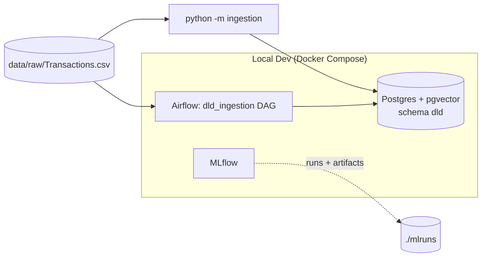

# Zestimator — Dubai Real Estate ML Platform

Portfolio-grade ML platform for Dubai real estate: property price
estimation, duplicate/fraud listing detection, and search ranking, built
on real Dubai Land Department (DLD) transaction data.

> **Status:** Phase 2 (DLD ingestion) complete. See
> `docs/superpowers/specs/` for the full 10-phase build plan.

## Architecture (current)



More components (ingestion pipeline, models, FastAPI service, Streamlit
UI) are added in later phases — this diagram grows with them.

## Local development

Prerequisites: Docker Desktop, [uv](https://docs.astral.sh/uv/).

```bash
cp .env.example .env
docker compose up -d --wait
uv sync
uv run pytest tests/ -v
```

`--wait` blocks until all three services report healthy (Airflow takes about a minute on first start). If a local Postgres already uses port 5432, set `POSTGRES_PORT=5433` (or any free port) in `.env` first; likewise set `MLFLOW_PORT` if something already holds 5000 (macOS AirPlay Receiver does by default). All ports bind to 127.0.0.1 only.

| Service | Where (default port — `.env` variable) |
|---|---|
| MLflow | http://localhost:5000 — `MLFLOW_PORT`. Runs and artifacts persist in `./mlruns` |
| Airflow | http://localhost:8080 — `AIRFLOW_PORT`. User `admin`; password via `docker compose exec airflow cat /opt/airflow/standalone_admin_password.txt` (in Git Bash, prefix with `MSYS_NO_PATHCONV=1`) |
| Postgres | `localhost:5432` — `POSTGRES_PORT`. Database, user, and password from `.env` |

## Data

Real Dubai Land Department transactions (see `data/README.md` for the source).
The file covers **1995-03-07 to 2023-03-17**, so every price estimate in this
project is **as of Q1 2023**. No synthetic data is used in the ingestion phase.

Of 1,047,965 transactions, **701,394** are clean open-market sales used
for modelling. Every other row is kept in Postgres with exactly one exclusion
reason (last full run, 30.2s):

| Reason | Rows | Why excluded |
|---|---:|---|
| `mortgage` | 224,183 | Mortgage registrations aren't sale prices |
| `gift` | 35,890 | Gifts aren't arm's-length prices |
| `non_market_procedure` | 57,241 | Sales-group procedures that aren't open-market sales (lease-to-own, development registration, …) |
| `missing_date` | 0 | No transaction date |
| `missing_price` | 753 | No price |
| `invalid_area` | 0 | Size missing or ≤ 0 |
| `price_below_floor` | 499 | Under AED 10,000 — placeholder or nominal transfer |
| `suspected_sqft_entry` | 2,807 | Price per m² is far too low, but would be normal if the size had been entered in sq ft |
| `price_outlier_low` | 11,430 | Price per m² more than 3.5 robust deviations below comparable sales |
| `price_outlier_high` | 13,768 | Price per m² more than 3.5 robust deviations above comparable sales |
| `duplicate_transaction_id` | 0 | Repeat of an earlier row |

"Comparable sales" means the same area, property type, ready/off-plan status
and year; groups with fewer than 30 sales fall back to wider groups, ending at
citywide by property type.

## Ingestion

```bash
uv run python -m ingestion            # host CLI; reads data/raw/Transactions.csv
docker compose exec airflow airflow dags trigger dld_ingestion   # same pipeline via Airflow (or use the ▶ button in the Airflow UI)
```

Each run replaces the `dld` tables atomically (a failed run leaves the previous
data untouched). Only one run can load at a time — a second concurrent run
stops immediately — and any run left marked `running` by a killed process is
marked failed as abandoned by the next run. Each run records itself in
`dld.ingestion_runs` with the file's SHA-256 and per-reason counts. Phase 3
trains on the `dld.market_sales` view; `price_per_sqm_aed` is derived from the
price and must never be used as a model feature. `dld.area_aliases` maps
familiar names (Dubai Marina, JBR, JLT, JVC, Downtown, …) to DLD's official
area names.

## Cost breakdown (current)

| Component | Cost |
|---|---|
| Postgres, MLflow, Airflow (local Docker) | $0 — runs on your machine |

Cloud costs are introduced in Phase 9 (deployment) and documented here as
they're added.

## Module layout

- `ingestion/` — DLD CSV validation, cleaning, and Postgres load (`python -m ingestion`)
- `dags/` — Airflow DAGs (`dld_ingestion`)
- `scripts/` — maintenance scripts (test-fixture builder)
- `models/` — price/fraud/ranking model code (Phase 3+)
- `api/` — FastAPI service (Phase 6)
- `demo/` — Streamlit app (Phase 7)
- `data/raw/` — drop DLD CSVs here (gitignored)
