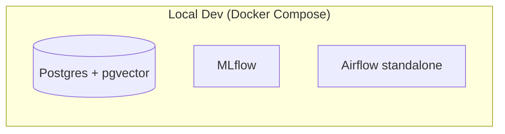

# Phase 1 — Foundation Implementation Plan

> **For agentic workers:** REQUIRED SUB-SKILL: Use superpowers:subagent-driven-development (recommended) or superpowers:executing-plans to implement this plan task-by-task. Steps use checkbox (`- [ ]`) syntax for tracking.

**Goal:** Stand up a working local dev environment for the Dubai Real Estate ML Platform: a git repo with clear module separation, a `uv`-managed Python project, and a Docker Compose stack (Postgres+pgvector, MLflow, Airflow) that all start cleanly and pass a smoke test.

**Architecture:** Single flat repo with placeholder module directories (`ingestion/`, `models/`, `api/`, `demo/`) that later phases fill in. One `docker-compose.yml` at the repo root defines three independent services. Infra health is verified with pytest-based smoke tests rather than application tests, since no application logic exists yet.

**Tech Stack:** Python 3.11+, uv, Docker Compose, `pgvector/pgvector:pg16`, MLflow (SQLite backend), Apache Airflow 2.10 (`standalone` mode), pytest, psycopg2, requests.

**Spec:** `docs/superpowers/specs/2026-09-14-phase1-foundation-design.md`

## Global Constraints

- Python >= 3.11
- Postgres image: `pgvector/pgvector:pg16`
- MLflow: SQLite backend store + local artifact root, both bind-mounted to `./mlruns`
- Airflow: `apache/airflow:2.10.3-python3.11`, run via `airflow standalone` command, own isolated metadata store (never shares the app Postgres container)
- Single `uv`-managed `pyproject.toml` at repo root — no per-module packages, `[tool.uv] package = false`
- Secrets only via `.env` (gitignored); `.env.example` committed with placeholders
- Out of scope this phase: DLD ingestion logic, model code, CI/CD wiring, cloud deployment, Airflow DAGs

---

## Task 1: Python project setup with uv

**Files:**
- Create: `pyproject.toml`
- Create: `.gitignore`
- Test: manual verification via `uv sync` and `uv run pytest --version`

**Interfaces:**
- Produces: a `.venv` and `uv.lock` that every later task's `uv run` / `uv add` commands depend on.

- [ ] **Step 1: Write `pyproject.toml`**

```toml
[project]
name = "zestimator"
version = "0.1.0"
description = "Dubai Real Estate ML Platform — price estimation, fraud detection, and search ranking on DLD transaction data"
requires-python = ">=3.11"
dependencies = []

[dependency-groups]
dev = [
    "pytest>=8.0",
    "ruff>=0.6",
    "psycopg2-binary>=2.9",
    "requests>=2.32",
]

[tool.uv]
package = false

[tool.pytest.ini_options]
testpaths = ["tests"]
pythonpath = ["."]

[tool.ruff]
line-length = 100
target-version = "py311"
```

- [ ] **Step 2: Write `.gitignore`**

```
.venv/
__pycache__/
*.pyc
.env
data/raw/*
!data/raw/.gitkeep
mlruns/
.pytest_cache/
.ruff_cache/
```

- [ ] **Step 3: Run `uv sync` and verify it succeeds**

Run: `uv sync`
Expected: creates `.venv/` and `uv.lock`, no errors.

- [ ] **Step 4: Verify pytest and ruff are runnable**

Run: `uv run pytest --version && uv run ruff --version`
Expected: both print version numbers, no errors.

- [ ] **Step 5: Commit**

```bash
git add pyproject.toml .gitignore uv.lock
git commit -m "chore: set up uv-managed Python project"
```

---

## Task 2: Module placeholders and data directory

**Files:**
- Create: `ingestion/__init__.py`
- Create: `models/__init__.py`
- Create: `api/__init__.py`
- Create: `demo/__init__.py`
- Create: `data/raw/.gitkeep`
- Create: `data/README.md`
- Test: `tests/test_module_placeholders.py`

**Interfaces:**
- Consumes: `.venv` from Task 1 (`uv run pytest`).
- Produces: importable top-level packages `ingestion`, `models`, `api`, `demo` that later phases add real code to.

- [ ] **Step 1: Write the failing test**

```python
# tests/test_module_placeholders.py
"""Confirms the Phase 1 placeholder module structure is importable."""
import importlib

import pytest


@pytest.mark.parametrize("module_name", ["ingestion", "models", "api", "demo"])
def test_module_importable(module_name):
    module = importlib.import_module(module_name)
    assert module.__doc__ is not None
```

- [ ] **Step 2: Run test to verify it fails**

Run: `uv run pytest tests/test_module_placeholders.py -v`
Expected: FAIL — `ModuleNotFoundError: No module named 'ingestion'` (and similarly for the others).

- [ ] **Step 3: Create the placeholder modules**

```python
# ingestion/__init__.py
"""DLD transaction ingestion pipeline (Phase 2)."""
```

```python
# models/__init__.py
"""Price estimation, fraud detection, and search ranking models (Phase 3+)."""
```

```python
# api/__init__.py
"""Unified FastAPI service (Phase 6)."""
```

```python
# demo/__init__.py
"""Streamlit demo UI (Phase 7)."""
```

- [ ] **Step 4: Create the data directory placeholders**

```
data/raw/.gitkeep
```
(empty file)

```markdown
# data/README.md
# data/raw/

Place downloaded Dubai Land Department (DLD) transaction CSV file(s) here.
This directory is gitignored — files are never committed.

Expected file naming and schema will be documented here once Phase 2
(ingestion pipeline) inspects the actual DLD CSV format. For now this is
a placeholder.
```

- [ ] **Step 5: Run test to verify it passes**

Run: `uv run pytest tests/test_module_placeholders.py -v`
Expected: PASS (4 passed).

- [ ] **Step 6: Commit**

```bash
git add ingestion/__init__.py models/__init__.py api/__init__.py demo/__init__.py data/raw/.gitkeep data/README.md tests/test_module_placeholders.py
git commit -m "chore: add placeholder module structure for ingestion/models/api/demo"
```

---

## Task 3: Postgres service with pgvector

**Files:**
- Create: `.env.example`
- Create: `docker/postgres-init.sql`
- Create: `docker-compose.yml`
- Create: `tests/test_infra_smoke.py`

**Interfaces:**
- Produces: a running Postgres reachable on `localhost:${POSTGRES_PORT}` (default 5432) with the `vector` extension available — later phases (ingestion, API) connect here.

- [ ] **Step 1: Write the failing test**

```python
# tests/test_infra_smoke.py
"""Infra smoke tests for the Phase 1 Docker Compose stack.

Run manually after `docker compose up -d`:
    uv run pytest tests/test_infra_smoke.py -v

Each test uses a short connection timeout and SKIPS (not fails) with a
clear message if the corresponding service isn't reachable, so running
this suite without Docker running gives a clear signal instead of a
mysterious hang or a red failure.
"""
import os

import psycopg2
import pytest

CONNECT_TIMEOUT = 5


def _env(name: str, default: str) -> str:
    return os.environ.get(name, default)


def test_postgres_pgvector():
    port = _env("POSTGRES_PORT", "5432")
    try:
        conn = psycopg2.connect(
            host="localhost",
            port=port,
            user=_env("POSTGRES_USER", "zestimator"),
            password=_env("POSTGRES_PASSWORD", "changeme"),
            dbname=_env("POSTGRES_DB", "zestimator"),
            connect_timeout=CONNECT_TIMEOUT,
        )
    except psycopg2.OperationalError as exc:
        pytest.skip(f"Postgres not reachable on localhost:{port} — start it with `docker compose up -d postgres`. ({exc})")

    try:
        with conn.cursor() as cur:
            cur.execute("CREATE EXTENSION IF NOT EXISTS vector;")
            conn.commit()
    finally:
        conn.close()
```

- [ ] **Step 2: Run test to verify it skips**

Run: `uv run pytest tests/test_infra_smoke.py -v`
Expected: SKIPPED with message "Postgres not reachable on localhost:5432 — start it with `docker compose up -d postgres`."

- [ ] **Step 3: Write `.env.example`**

```
POSTGRES_USER=zestimator
POSTGRES_PASSWORD=changeme
POSTGRES_DB=zestimator
POSTGRES_PORT=5432
MLFLOW_TRACKING_URI=http://localhost:5000
AIRFLOW_PORT=8080
```

- [ ] **Step 4: Write `docker/postgres-init.sql`**

```sql
CREATE EXTENSION IF NOT EXISTS vector;
```

- [ ] **Step 5: Write `docker-compose.yml`**

```yaml
services:
  postgres:
    image: pgvector/pgvector:pg16
    container_name: zestimator-postgres
    environment:
      POSTGRES_USER: ${POSTGRES_USER}
      POSTGRES_PASSWORD: ${POSTGRES_PASSWORD}
      POSTGRES_DB: ${POSTGRES_DB}
    ports:
      - "${POSTGRES_PORT}:5432"
    volumes:
      - postgres_data:/var/lib/postgresql/data
      - ./docker/postgres-init.sql:/docker-entrypoint-initdb.d/postgres-init.sql
    healthcheck:
      test: ["CMD-SHELL", "pg_isready -U ${POSTGRES_USER} -d ${POSTGRES_DB}"]
      interval: 5s
      timeout: 5s
      retries: 5

volumes:
  postgres_data:
```

- [ ] **Step 6: Copy `.env.example` to `.env`, start Postgres, and run test to verify it passes**

Run:
```bash
cp .env.example .env
docker compose up -d postgres
uv run pytest tests/test_infra_smoke.py -v
```
Expected: PASS — `test_postgres_pgvector` passes (may take a few seconds for the container's first-start healthcheck).

- [ ] **Step 7: Commit**

```bash
git add .env.example docker/postgres-init.sql docker-compose.yml tests/test_infra_smoke.py
git commit -m "feat: add Postgres+pgvector service with smoke test"
```

---

## Task 4: MLflow service

**Files:**
- Create: `Dockerfile.mlflow`
- Modify: `docker-compose.yml` (add `mlflow` service)
- Modify: `tests/test_infra_smoke.py` (add `test_mlflow_health`)

**Interfaces:**
- Consumes: nothing from earlier tasks (independent service).
- Produces: MLflow tracking server reachable at `http://localhost:5000` — later phases (model training) log runs here.

- [ ] **Step 1: Add the failing test**

Append to `tests/test_infra_smoke.py`:

```python
import requests


def test_mlflow_health():
    try:
        resp = requests.get("http://localhost:5000/", timeout=CONNECT_TIMEOUT)
    except requests.exceptions.ConnectionError as exc:
        pytest.skip(f"MLflow not reachable on localhost:5000 — start it with `docker compose up -d mlflow`. ({exc})")

    assert resp.status_code == 200
```

(Move the `import requests` to the top of the file alongside the existing imports.)

- [ ] **Step 2: Run test to verify it skips**

Run: `uv run pytest tests/test_infra_smoke.py::test_mlflow_health -v`
Expected: SKIPPED with message "MLflow not reachable on localhost:5000 — start it with `docker compose up -d mlflow`."

- [ ] **Step 3: Write `Dockerfile.mlflow`**

```dockerfile
FROM python:3.11-slim

RUN pip install --no-cache-dir mlflow==2.17.2

WORKDIR /mlflow

EXPOSE 5000

CMD ["mlflow", "server", \
     "--backend-store-uri", "sqlite:////mlflow/mlruns/mlflow.db", \
     "--default-artifact-root", "/mlflow/mlruns/artifacts", \
     "--host", "0.0.0.0", \
     "--port", "5000"]
```

- [ ] **Step 4: Add the `mlflow` service to `docker-compose.yml`**

Add this service under `services:`, alongside `postgres`:

```yaml
  mlflow:
    build:
      context: .
      dockerfile: Dockerfile.mlflow
    container_name: zestimator-mlflow
    ports:
      - "5000:5000"
    volumes:
      - ./mlruns:/mlflow/mlruns
```

- [ ] **Step 5: Start MLflow and run test to verify it passes**

Run:
```bash
docker compose up -d --build mlflow
uv run pytest tests/test_infra_smoke.py::test_mlflow_health -v
```
Expected: PASS. If it fails with a non-200 status, open `http://localhost:5000/` in a browser to confirm the actual root path behavior for MLflow 2.17.2 and adjust the assertion/path accordingly (documented as a fallback in the spec).

- [ ] **Step 6: Commit**

```bash
git add Dockerfile.mlflow docker-compose.yml tests/test_infra_smoke.py
git commit -m "feat: add MLflow tracking server with smoke test"
```

---

## Task 5: Airflow service (standalone)

**Files:**
- Modify: `docker-compose.yml` (add `airflow` service)
- Modify: `tests/test_infra_smoke.py` (add `test_airflow_health`)

**Interfaces:**
- Consumes: nothing from earlier tasks (independent service, isolated metadata store).
- Produces: Airflow webserver reachable at `http://localhost:8080` for local DAG development in later phases (no DAGs exist yet).

- [ ] **Step 1: Add the failing test**

Append to `tests/test_infra_smoke.py`:

```python
def test_airflow_health():
    try:
        resp = requests.get("http://localhost:8080/health", timeout=CONNECT_TIMEOUT)
    except requests.exceptions.ConnectionError as exc:
        pytest.skip(
            "Airflow not reachable on localhost:8080 — start it with `docker compose up -d airflow`. "
            f"Note: Airflow standalone can take 30-60s to become healthy on first start. ({exc})"
        )

    assert resp.status_code == 200
```

- [ ] **Step 2: Run test to verify it skips**

Run: `uv run pytest tests/test_infra_smoke.py::test_airflow_health -v`
Expected: SKIPPED with the Airflow-not-reachable message.

- [ ] **Step 3: Add the `airflow` service to `docker-compose.yml`**

```yaml
  airflow:
    image: apache/airflow:2.10.3-python3.11
    container_name: zestimator-airflow
    command: standalone
    environment:
      AIRFLOW__CORE__LOAD_EXAMPLES: "false"
    ports:
      - "${AIRFLOW_PORT}:8080"
    volumes:
      - airflow_data:/opt/airflow
```

Also add `airflow_data:` under the top-level `volumes:` key (alongside `postgres_data:`).

- [ ] **Step 4: Start Airflow and run test to verify it passes**

Run:
```bash
docker compose up -d airflow
# wait ~30-60s for first-run initialization (db migrate + admin user creation)
uv run pytest tests/test_infra_smoke.py::test_airflow_health -v
```
Expected: PASS. If it's still initializing, re-run the test after another 30s rather than treating an immediate SKIP as a failure.

- [ ] **Step 5: Run the full smoke suite together**

Run:
```bash
docker compose up -d
uv run pytest tests/ -v
```
Expected: all tests pass (`test_module_placeholders.py` — 4 passed, `test_infra_smoke.py` — 3 passed).

- [ ] **Step 6: Commit**

```bash
git add docker-compose.yml tests/test_infra_smoke.py
git commit -m "feat: add Airflow standalone service with smoke test"
```

---

## Task 6: README with architecture diagram and cost breakdown

**Files:**
- Create: `README.md`

**Interfaces:**
- Consumes: nothing (documentation only).
- Produces: the top-level project README that later phases extend (each phase adds to the Mermaid diagram, module list, and cost table rather than replacing them).

- [ ] **Step 1: Write `README.md`**

Write this exact content to `README.md` (using real triple-backtick fences for the `mermaid` and `bash` blocks shown below — they are not further escaped):

---START FILE CONTENT---
# Zestimator — Dubai Real Estate ML Platform

Portfolio-grade ML platform for Dubai real estate: property price
estimation, duplicate/fraud listing detection, and search ranking, built
on real Dubai Land Department (DLD) transaction data.

> **Status:** Phase 1 (foundation) complete. See
> `docs/superpowers/specs/` for the full 10-phase build plan.

## Architecture (current)



More components (ingestion pipeline, models, FastAPI service, Streamlit
UI) are added in later phases — this diagram grows with them.

## Local development

Prerequisites: Docker Desktop, [uv](https://docs.astral.sh/uv/).

```bash
cp .env.example .env
docker compose up -d
uv sync
uv run pytest tests/ -v
```

## Cost breakdown (current)

| Component | Cost |
|---|---|
| Postgres, MLflow, Airflow (local Docker) | $0 — runs on your machine |

Cloud costs are introduced in Phase 9 (deployment) and documented here as
they're added.

## Module layout

- `ingestion/` — DLD CSV cleaning pipeline (Phase 2)
- `models/` — price/fraud/ranking model code (Phase 3+)
- `api/` — FastAPI service (Phase 6)
- `demo/` — Streamlit app (Phase 7)
- `data/raw/` — drop DLD CSVs here (gitignored)
---END FILE CONTENT---

- [ ] **Step 2: Verify the Mermaid block renders**

Open `README.md` in a Markdown previewer (VS Code preview, GitHub, etc.) and confirm the diagram renders without syntax errors.

- [ ] **Step 3: Commit**

```bash
git add README.md
git commit -m "docs: add Phase 1 README with architecture diagram and cost breakdown"
```

---

## Final verification

- [ ] Run `docker compose up -d` from a clean state (`docker compose down -v` first) and confirm all three containers start.
- [ ] Run `uv run pytest tests/ -v` and confirm 7 tests pass (4 module placeholder + 3 infra smoke).
- [ ] Run `uv run ruff check .` and confirm no lint errors.
- [ ] Confirm `git log --oneline` shows 6 commits (one per task) plus the earlier spec commit.
