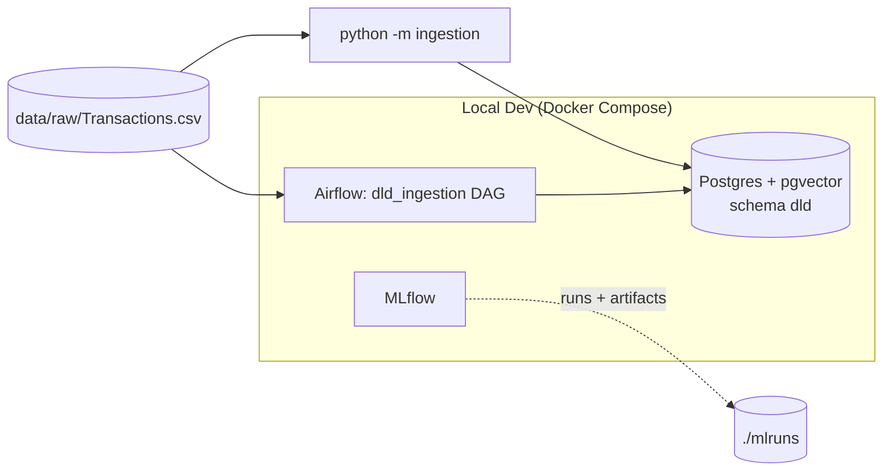

# Phase 2 — DLD Ingestion Implementation Plan

> **For agentic workers:** REQUIRED SUB-SKILL: Use superpowers:subagent-driven-development (recommended) or superpowers:executing-plans to implement this plan task-by-task. Steps use checkbox (`- [ ]`) syntax for tracking.

**Goal:** Load `data/raw/Transactions.csv` (DLD) into Postgres with strict validation, normalization, one exclusion reason per non-market row, a `dld.market_sales` view, and an area alias table — runnable from the CLI and as an Airflow DAG.

**Architecture:** Flat `ingestion/` package of small pure-Polars modules (schema → normalize → rules → areas) feeding a load module that COPYs everything into schema `dld` inside one transaction. `run_pipeline()` orchestrates; `python -m ingestion` and `dags/dld_ingestion.py` both call it.

**Tech Stack:** Python 3.11+, Polars, psycopg2, python-dotenv, pytest, Postgres 16, Airflow 2.10.3.

**Spec:** `docs/superpowers/specs/2026-09-15-phase2-ingestion-design.md`

## Global Constraints

- Source file: `data/raw/Transactions.csv`; 46 columns; missing numerics are the literal token `null`; dates `DD-MM-YYYY`.
- Canonical size unit is square metres; `area_sqm = procedure_area`, no conversion.
- `MARKET_SALE_PROCEDURES = {"Sell", "Sell - Pre registration", "Delayed Sell", "Sale On Payment Plan"}`.
- Reason order (first match wins): `duplicate_transaction_id, mortgage, gift, non_market_procedure, missing_date, missing_price, invalid_area, price_below_floor, suspected_sqft_entry, price_outlier_low, price_outlier_high`.
- Price floor AED 10,000; peer group min 30 rows and MAD > 0; robust z threshold 3.5; MAD scale 1.4826; sqft per sqm 10.7639.
- `price_per_sqm_aed` is target-derived — never a model feature (Phase 3).
- Postgres schema `dld`; tables `ingestion_runs, transactions, areas, area_aliases`; view `market_sales`.
- All validation happens before any DB connection. Load is one transaction; a failed run leaves previous data intact.
- Tests connect to Postgres at `127.0.0.1:${POSTGRES_PORT}` (this machine: 5433). NEVER touch the native Windows Postgres on host port 5432.
- Work directly on `master`. Never `git add -A`/`git add .`; never commit `.env`, `data/raw/*`, or `mlruns/`.
- Commit message trailer: `Co-Authored-By: Claude Opus 5 <noreply@anthropic.com>`.
- Run commands from the repo root `C:\Users\cnaya\OneDrive\Desktop\dubimator` using Git Bash.

---

## Task 1: Dependencies, DB settings, and test fixtures

**Files:**
- Modify: `pyproject.toml`, `uv.lock`, `tests/test_infra_smoke.py:12-20`
- Create: `ingestion/config.py`, `tests/conftest.py`, `tests/ingestion/test_config.py`

**Interfaces:**
- Produces: `ingestion.config.DbSettings` (frozen dataclass: `host: str, port: int, user: str, password: str, dbname: str`; `DbSettings.from_env() -> DbSettings`; `.connect() -> psycopg2 connection`). Pytest fixture `pg_test_db` (yields `DbSettings` for a fresh database `dubimator_test`).

- [ ] **Step 1: Update dependencies**

```bash
uv add polars psycopg2-binary python-dotenv
uv remove --dev psycopg2-binary python-dotenv
```

Then add to `pyproject.toml` under the existing `[tool.ruff]` table:

```toml
extend-exclude = ["docs"]
```

Verify: `uv run python -c "import polars, psycopg2, dotenv; print(polars.__version__)"` prints a version.

- [ ] **Step 2: Write the failing config test**

`tests/ingestion/test_config.py`:

```python
import pytest

from ingestion.config import DbSettings

ENV_VARS = ("POSTGRES_HOST", "POSTGRES_PORT", "POSTGRES_USER", "POSTGRES_PASSWORD", "POSTGRES_DB")


def test_defaults_when_env_is_empty(monkeypatch):
    for name in ENV_VARS:
        monkeypatch.delenv(name, raising=False)
    assert DbSettings.from_env() == DbSettings(
        host="127.0.0.1", port=5432, user="dubimator", password="changeme", dbname="dubimator"
    )


def test_reads_environment(monkeypatch):
    monkeypatch.setenv("POSTGRES_HOST", "postgres")
    monkeypatch.setenv("POSTGRES_PORT", "5433")
    monkeypatch.setenv("POSTGRES_USER", "u")
    monkeypatch.setenv("POSTGRES_PASSWORD", "p")
    monkeypatch.setenv("POSTGRES_DB", "d")
    assert DbSettings.from_env() == DbSettings(host="postgres", port=5433, user="u", password="p", dbname="d")


def test_non_numeric_port_raises(monkeypatch):
    monkeypatch.setenv("POSTGRES_PORT", "abc")
    with pytest.raises(ValueError):
        DbSettings.from_env()
```

- [ ] **Step 3: Run it to verify it fails**

Run: `uv run pytest tests/ingestion/test_config.py -v`
Expected: FAIL — `ModuleNotFoundError: No module named 'ingestion.config'`.

- [ ] **Step 4: Implement `ingestion/config.py`**

```python
import os
from dataclasses import dataclass

import psycopg2


@dataclass(frozen=True)
class DbSettings:
    host: str
    port: int
    user: str
    password: str
    dbname: str

    @classmethod
    def from_env(cls) -> "DbSettings":
        return cls(
            host=os.environ.get("POSTGRES_HOST", "127.0.0.1"),
            port=int(os.environ.get("POSTGRES_PORT", "5432")),
            user=os.environ.get("POSTGRES_USER", "dubimator"),
            password=os.environ.get("POSTGRES_PASSWORD", "changeme"),
            dbname=os.environ.get("POSTGRES_DB", "dubimator"),
        )

    def connect(self):
        return psycopg2.connect(
            host=self.host,
            port=self.port,
            user=self.user,
            password=self.password,
            dbname=self.dbname,
            connect_timeout=10,
        )
```

(`load_dotenv()` is called by the CLI and by `tests/conftest.py`, not here, so `from_env` stays a pure env read and is testable.)

- [ ] **Step 5: Run it to verify it passes**

Run: `uv run pytest tests/ingestion/test_config.py -v`
Expected: 3 passed.

- [ ] **Step 6: Write the failing fixture test**

Append to `tests/ingestion/test_config.py`:

```python
def test_pg_test_db_is_a_separate_database(pg_test_db):
    conn = pg_test_db.connect()
    try:
        with conn.cursor() as cur:
            cur.execute("SELECT current_database()")
            assert cur.fetchone()[0] == "dubimator_test"
    finally:
        conn.close()
```

Run: `uv run pytest tests/ingestion/test_config.py::test_pg_test_db_is_a_separate_database -v`
Expected: ERROR — `fixture 'pg_test_db' not found`.

- [ ] **Step 7: Create `tests/conftest.py`**

```python
import dataclasses
import socket

import psycopg2
import pytest
from dotenv import load_dotenv

load_dotenv()  # no override: shell env wins, matching docker compose's own precedence

from ingestion.config import DbSettings  # noqa: E402

TEST_DB = "dubimator_test"


@pytest.fixture
def pg_test_db():
    base = DbSettings.from_env()
    try:
        socket.create_connection((base.host, base.port), timeout=5).close()
    except OSError as exc:
        pytest.skip(
            f"Postgres not reachable at {base.host}:{base.port} — start the stack with "
            f"`docker compose up -d --wait`. ({exc})"
        )
    admin = psycopg2.connect(
        host=base.host, port=base.port, user=base.user, password=base.password, dbname=base.dbname
    )
    admin.autocommit = True
    try:
        with admin.cursor() as cur:
            cur.execute(f"DROP DATABASE IF EXISTS {TEST_DB} WITH (FORCE)")
            cur.execute(f"CREATE DATABASE {TEST_DB}")
        yield dataclasses.replace(base, dbname=TEST_DB)
    finally:
        with admin.cursor() as cur:
            cur.execute(f"DROP DATABASE IF EXISTS {TEST_DB} WITH (FORCE)")
        admin.close()
```

- [ ] **Step 8: Remove the now-duplicated dotenv loading from `tests/test_infra_smoke.py`**

Delete these lines (the import and the call; `conftest.py` now does it for every test):

```python
from dotenv import load_dotenv

load_dotenv()  # no override: shell env wins, matching docker compose's own precedence
```

- [ ] **Step 9: Run the full suite**

Run: `uv run pytest tests/ -v`
Expected: 12 passed (8 existing + 4 new). Then `uv run ruff check . && uv run ruff format --check .` → clean (run `uv run ruff format tests ingestion` first if needed).

- [ ] **Step 10: Commit**

```bash
git add pyproject.toml uv.lock ingestion/config.py tests/conftest.py tests/ingestion/test_config.py tests/test_infra_smoke.py
git commit -m "feat(ingestion): add DB settings, deps, and test database fixture"
```

---

## Task 2: Read and validate the source file (`schema.py`)

**Files:**
- Create: `ingestion/schema.py`, `tests/ingestion/conftest.py`, `tests/ingestion/test_schema.py`

**Interfaces:**
- Produces: `EXPECTED_COLUMNS: frozenset[str]` (46 names), `CLOSED_DOMAINS: dict[str, frozenset[str]]`, exceptions `SourceFileError(ValueError)` and `SchemaDriftError(SourceFileError)`, `validate_columns(columns: Iterable[str]) -> None`, `validate_domains(df: pl.DataFrame) -> None`, `read_raw(path: Path) -> pl.DataFrame` (all columns `pl.Utf8`, the token `null` read as null).
- Produces (test helpers in `tests/ingestion/conftest.py`, used by later tasks): `BASE_RAW_ROW: dict[str, str]`, fixture `write_dld_csv(rows: list[dict], columns: list[str] | None = None, name="dld.csv") -> Path`, fixture `make_raw(rows: list[dict]) -> pl.DataFrame` (all-`Utf8` frame shaped like `read_raw` output; `"null"` values become null).

- [ ] **Step 1: Create the shared test helpers `tests/ingestion/conftest.py`**

```python
import csv

import polars as pl
import pytest

BASE_RAW_ROW = {
    "transaction_id": "1-11-2020-100",
    "procedure_id": "11",
    "trans_group_id": "1",
    "trans_group_ar": "مبايعات",
    "trans_group_en": "Sales",
    "procedure_name_ar": "بيع",
    "procedure_name_en": "Sell",
    "instance_date": "15-06-2020",
    "property_type_id": "3",
    "property_type_ar": "وحدة",
    "property_type_en": "Unit",
    "property_sub_type_id": "60",
    "property_sub_type_ar": "شقة",
    "property_sub_type_en": "Flat",
    "property_usage_ar": "سكني",
    "property_usage_en": "Residential",
    "reg_type_id": "1",
    "reg_type_ar": "العقارات القائمة",
    "reg_type_en": "Existing Properties",
    "area_id": "364",
    "area_name_ar": "مرسى دبي",
    "area_name_en": "Marsa Dubai",
    "building_name_ar": "",
    "building_name_en": "MARINA TOWER",
    "project_number": "1234",
    "project_name_ar": "",
    "project_name_en": "Marina Tower",
    "master_project_en": "Dubai Marina",
    "master_project_ar": "",
    "nearest_landmark_ar": "",
    "nearest_landmark_en": "Burj Al Arab",
    "nearest_metro_ar": "",
    "nearest_metro_en": "DAMAC Properties",
    "nearest_mall_ar": "",
    "nearest_mall_en": "Marina Mall",
    "rooms_ar": "",
    "rooms_en": "1 B/R",
    "has_parking": "1",
    "procedure_area": "80.5",
    "actual_worth": "1200000",
    "meter_sale_price": "14906.83",
    "rent_value": "null",
    "meter_rent_price": "null",
    "no_of_parties_role_1": "1",
    "no_of_parties_role_2": "1",
    "no_of_parties_role_3": "0",
}


@pytest.fixture
def write_dld_csv(tmp_path):
    def write(rows, columns=None, name="dld.csv"):
        columns = columns or list(BASE_RAW_ROW)
        path = tmp_path / name
        with path.open("w", encoding="utf-8", newline="") as fh:
            writer = csv.writer(fh)
            writer.writerow(columns)
            for overrides in rows:
                record = {**BASE_RAW_ROW, **overrides}
                writer.writerow([record.get(column, "") for column in columns])
        return path

    return write


@pytest.fixture
def make_raw():
    def build(rows):
        records = []
        for overrides in rows:
            record = {**BASE_RAW_ROW, **overrides}
            records.append({k: (None if v == "null" else v) for k, v in record.items()})
        return pl.DataFrame(records, schema={column: pl.Utf8 for column in BASE_RAW_ROW})

    return build
```

- [ ] **Step 2: Write the failing tests `tests/ingestion/test_schema.py`**

```python
import polars as pl
import pytest

from ingestion.schema import (
    EXPECTED_COLUMNS,
    SchemaDriftError,
    SourceFileError,
    read_raw,
    validate_columns,
)


def test_expected_columns_has_46_names():
    assert len(EXPECTED_COLUMNS) == 46


def test_reads_all_columns_as_strings(write_dld_csv):
    df = read_raw(write_dld_csv([{}, {"transaction_id": "x-2", "actual_worth": "null"}]))
    assert df.shape == (2, 46)
    assert all(dtype == pl.Utf8 for dtype in df.dtypes)
    assert df["actual_worth"].to_list() == ["1200000", None]
    assert df["area_name_ar"][0] == "مرسى دبي"


def test_column_order_does_not_matter(write_dld_csv):
    df = read_raw(write_dld_csv([{}], columns=sorted(EXPECTED_COLUMNS)))
    assert set(df.columns) == EXPECTED_COLUMNS


def test_missing_column_raises(write_dld_csv):
    columns = [c for c in sorted(EXPECTED_COLUMNS) if c != "actual_worth"]
    with pytest.raises(SchemaDriftError, match="actual_worth"):
        read_raw(write_dld_csv([{}], columns=columns))


def test_extra_column_raises(write_dld_csv):
    with pytest.raises(SchemaDriftError, match="amount"):
        read_raw(write_dld_csv([{}], columns=[*sorted(EXPECTED_COLUMNS), "amount"]))


def test_renamed_column_reports_both_names():
    renamed = [c if c != "procedure_area" else "procedure_area_sqft" for c in EXPECTED_COLUMNS]
    with pytest.raises(SchemaDriftError) as info:
        validate_columns(renamed)
    assert "'procedure_area'" in str(info.value)
    assert "'procedure_area_sqft'" in str(info.value)


@pytest.mark.parametrize(
    "column, value",
    [("trans_group_en", "Leases"), ("reg_type_en", "Planned"), ("property_type_en", "Parking")],
)
def test_unexpected_domain_value_raises(write_dld_csv, column, value):
    with pytest.raises(SchemaDriftError, match=value):
        read_raw(write_dld_csv([{}, {column: value}]))


def test_empty_domain_value_raises(write_dld_csv):
    with pytest.raises(SchemaDriftError, match="trans_group_en"):
        read_raw(write_dld_csv([{"trans_group_en": ""}]))


def test_invalid_utf8_raises(write_dld_csv):
    path = write_dld_csv([{}])
    path.write_bytes(path.read_bytes().replace(b"Marina Mall", b"Marina \xff\xfe Mall"))
    with pytest.raises(SourceFileError):
        read_raw(path)


def test_missing_file_raises(tmp_path):
    with pytest.raises(FileNotFoundError, match="nope.csv"):
        read_raw(tmp_path / "nope.csv")
```

- [ ] **Step 3: Run them to verify they fail**

Run: `uv run pytest tests/ingestion/test_schema.py -v`
Expected: FAIL — `ModuleNotFoundError: No module named 'ingestion.schema'`.

- [ ] **Step 4: Implement `ingestion/schema.py`**

```python
from collections.abc import Iterable
from pathlib import Path

import polars as pl

EXPECTED_COLUMNS = frozenset(
    {
        "transaction_id", "procedure_id", "trans_group_id", "trans_group_ar", "trans_group_en",
        "procedure_name_ar", "procedure_name_en", "instance_date", "property_type_id",
        "property_type_ar", "property_type_en", "property_sub_type_id", "property_sub_type_ar",
        "property_sub_type_en", "property_usage_ar", "property_usage_en", "reg_type_id",
        "reg_type_ar", "reg_type_en", "area_id", "area_name_ar", "area_name_en",
        "building_name_ar", "building_name_en", "project_number", "project_name_ar",
        "project_name_en", "master_project_en", "master_project_ar", "nearest_landmark_ar",
        "nearest_landmark_en", "nearest_metro_ar", "nearest_metro_en", "nearest_mall_ar",
        "nearest_mall_en", "rooms_ar", "rooms_en", "has_parking", "procedure_area",
        "actual_worth", "meter_sale_price", "rent_value", "meter_rent_price",
        "no_of_parties_role_1", "no_of_parties_role_2", "no_of_parties_role_3",
    }
)

CLOSED_DOMAINS = {
    "trans_group_en": frozenset({"Sales", "Mortgages", "Gifts"}),
    "reg_type_en": frozenset({"Existing Properties", "Off-Plan Properties"}),
    "property_type_en": frozenset({"Unit", "Villa", "Land", "Building"}),
}


class SourceFileError(ValueError):
    pass


class SchemaDriftError(SourceFileError):
    pass


def validate_columns(columns: Iterable[str]) -> None:
    actual = set(columns)
    missing = sorted(EXPECTED_COLUMNS - actual)
    unexpected = sorted(actual - EXPECTED_COLUMNS)
    if missing or unexpected:
        raise SchemaDriftError(
            f"DLD CSV columns changed. Missing: {missing}. Unexpected: {unexpected}."
        )


def validate_domains(df: pl.DataFrame) -> None:
    for column, allowed in CLOSED_DOMAINS.items():
        unexpected = set(df[column].unique().to_list()) - allowed
        if unexpected:
            raise SchemaDriftError(f"Unexpected values in {column}: {sorted(map(repr, unexpected))}")


def read_raw(path: Path) -> pl.DataFrame:
    path = Path(path)
    if not path.is_file():
        raise FileNotFoundError(f"DLD CSV not found: {path}")
    try:
        df = pl.read_csv(path, infer_schema=False, null_values=["null"], encoding="utf8")
    except pl.exceptions.PolarsError as exc:
        raise SourceFileError(f"Could not read {path}: {exc}") from exc
    validate_columns(df.columns)
    validate_domains(df)
    return df
```

(`uv run ruff format ingestion` may reflow the column set — that's fine.)

- [ ] **Step 5: Run them to verify they pass**

Run: `uv run pytest tests/ingestion/test_schema.py -v`
Expected: 12 passed. If `test_invalid_utf8_raises` fails because Polars does not raise on invalid bytes, report it (DONE_WITH_CONCERNS) with the observed behaviour rather than weakening the test.

- [ ] **Step 6: Commit**

```bash
git add ingestion/schema.py tests/ingestion/conftest.py tests/ingestion/test_schema.py
git commit -m "feat(ingestion): strict DLD CSV reading with schema-drift checks"
```

---

## Task 3: Normalize values into a typed frame (`normalize.py`)

**Files:**
- Create: `ingestion/normalize.py`, `tests/ingestion/test_normalize.py`

**Interfaces:**
- Consumes: `make_raw` fixture (Task 2); the raw frame shape from `read_raw`.
- Produces: pure functions `parse_date(str|None) -> date|None`, `parse_float(str|None) -> float|None`, `parse_int(str|None) -> int|None`, `parse_rooms(str|None) -> tuple[str|None, int|None]`, `clean_display_name(str|None) -> str|None`, `match_key(str|None) -> str|None`; helper `map_unique(series: pl.Series, fn, dtype) -> pl.Series`; `TYPED_SCHEMA: dict[str, pl.DataType]` (ordered; its keys are the typed column names, in `dld.transactions` order); `to_typed(raw: pl.DataFrame) -> pl.DataFrame` (exactly `TYPED_SCHEMA` columns and dtypes).

- [ ] **Step 1: Write the failing tests `tests/ingestion/test_normalize.py`**

```python
from datetime import date

import polars as pl
import pytest

from ingestion.normalize import (
    TYPED_SCHEMA,
    clean_display_name,
    map_unique,
    match_key,
    parse_date,
    parse_float,
    parse_int,
    parse_rooms,
    to_typed,
)


@pytest.mark.parametrize(
    "value, expected",
    [
        ("15-06-2020", date(2020, 6, 15)),
        (" 01-01-1995 ", date(1995, 1, 1)),
        ("31-02-2020", None),
        ("2020-06-15", None),
        ("", None),
        (None, None),
        ("garbage", None),
    ],
)
def test_parse_date(value, expected):
    assert parse_date(value) == expected


@pytest.mark.parametrize(
    "value, expected",
    [("1200000", 1200000.0), ("80.5", 80.5), (" 12 ", 12.0), ("", None), (None, None),
     ("abc", None), ("nan", None), ("inf", None)],
)
def test_parse_float(value, expected):
    assert parse_float(value) == expected


@pytest.mark.parametrize(
    "value, expected",
    [("364", 364), ("7.0", 7), ("7.5", None), ("", None), (None, None), ("x", None)],
)
def test_parse_int(value, expected):
    assert parse_int(value) == expected


@pytest.mark.parametrize(
    "value, expected",
    [
        ("Studio", ("Studio", 0)),
        ("1 B/R", ("1 B/R", 1)),
        ("9 B/R", ("9 B/R", 9)),
        ("2 b/r", ("2 B/R", 2)),
        ("PENTHOUSE", ("Penthouse", None)),
        ("GYM", ("Gym", None)),
        ("Office", ("Office", None)),
        ("Shop", ("Shop", None)),
        ("Single Room", ("Single Room", None)),
        ("Store", ("Store", None)),
        ("", (None, None)),
        (None, (None, None)),
        ("  Loft  ", ("Loft", None)),
    ],
)
def test_parse_rooms(value, expected):
    assert parse_rooms(value) == expected


@pytest.mark.parametrize(
    "value, expected",
    [
        ("Al Khairan  Second", "Al Khairan Second"),
        ("MADINAT HIND 2", "Madinat Hind 2"),
        ("DIFC", "DIFC"),
        ("JBR", "JBR"),
        ("Al-Nahdah", "Al-Nahdah"),
        ("  Marsa Dubai ", "Marsa Dubai"),
        ("مرسى دبي", "مرسى دبي"),
        ("", None),
        ("   ", None),
        (None, None),
    ],
)
def test_clean_display_name(value, expected):
    assert clean_display_name(value) == expected


@pytest.mark.parametrize(
    "value, expected",
    [
        ("Al-Nahdah", "nahdah"),
        ("Jumeriah Beach Residence  - JBR", "jumeriah beach residence jbr"),
        ("Al Barsha South Fourth", "barsha south fourth"),
        ("Me'Aisem First", "me aisem first"),
        ("مرسى دبي", None),
        ("", None),
        (None, None),
    ],
)
def test_match_key(value, expected):
    assert match_key(value) == expected


def test_map_unique_applies_function_and_keeps_nulls():
    series = pl.Series("s", ["2", None, "2", "x"])
    assert map_unique(series, parse_int, pl.Int64).to_list() == [2, None, 2, None]


def test_map_unique_on_all_null_series():
    series = pl.Series("s", [None, None], dtype=pl.Utf8)
    assert map_unique(series, parse_int, pl.Int64).to_list() == [None, None]


def test_to_typed_schema_and_values(make_raw):
    raw = make_raw(
        [
            {"procedure_name_en": "  Sell ", "area_name_en": "Al Khairan  Second"},
            {
                "trans_group_en": "Mortgages",
                "reg_type_en": "Off-Plan Properties",
                "property_type_en": "Villa",
                "instance_date": "",
                "actual_worth": "null",
                "has_parking": "0",
                "rooms_en": "Studio",
                "master_project_en": "",
            },
        ]
    )
    typed = to_typed(raw)
    assert typed.schema == pl.Schema(TYPED_SCHEMA)
    first, second = typed.to_dicts()
    assert first["source_row"] == 1 and second["source_row"] == 2
    assert first["procedure_name"] == "Sell"
    assert first["trans_group"] == "sales" and second["trans_group"] == "mortgages"
    assert first["reg_type"] == "ready" and second["reg_type"] == "off_plan"
    assert second["property_type"] == "villa"
    assert first["instance_date"] == date(2020, 6, 15) and first["year"] == 2020
    assert second["instance_date"] is None and second["year"] is None
    assert first["area_name"] == "Al Khairan Second"
    assert first["building_name"] == "Marina Tower"
    assert first["area_id"] == 364 and first["project_number"] == 1234
    assert first["rooms"] == "1 B/R" and first["bedrooms"] == 1
    assert second["rooms"] == "Studio" and second["bedrooms"] == 0
    assert first["has_parking"] is True and second["has_parking"] is False
    assert first["area_sqm"] == 80.5 and first["price_aed"] == 1_200_000.0
    assert first["price_per_sqm_aed"] == pytest.approx(1_200_000 / 80.5)
    assert second["price_aed"] is None and second["price_per_sqm_aed"] is None
    assert second["master_project"] is None
    assert first["parties_role_1"] == 1 and first["parties_role_3"] == 0


def test_to_typed_zero_area_gives_null_price_per_sqm(make_raw):
    typed = to_typed(make_raw([{"procedure_area": "0"}]))
    assert typed["area_sqm"][0] == 0.0
    assert typed["price_per_sqm_aed"][0] is None
```

- [ ] **Step 2: Run them to verify they fail**

Run: `uv run pytest tests/ingestion/test_normalize.py -v`
Expected: FAIL — `ModuleNotFoundError: No module named 'ingestion.normalize'`.

- [ ] **Step 3: Implement `ingestion/normalize.py`**

```python
import math
import re
from datetime import date, datetime

import polars as pl

TRANS_GROUPS = {"Sales": "sales", "Mortgages": "mortgages", "Gifts": "gifts"}
REG_TYPES = {"Existing Properties": "ready", "Off-Plan Properties": "off_plan"}
PARKING = {"1": True, "0": False}

_BEDROOMS = re.compile(r"^([1-9]) B/R$", re.IGNORECASE)
_ROOM_LABELS = {
    "STUDIO": "Studio",
    "PENTHOUSE": "Penthouse",
    "GYM": "Gym",
    "OFFICE": "Office",
    "SHOP": "Shop",
    "SINGLE ROOM": "Single Room",
    "STORE": "Store",
}
_NON_ALNUM = re.compile(r"[^0-9a-z]+")

TYPED_SCHEMA = {
    "transaction_id": pl.Utf8,
    "source_row": pl.Int64,
    "trans_group": pl.Utf8,
    "procedure_name": pl.Utf8,
    "instance_date": pl.Date,
    "year": pl.Int16,
    "property_type": pl.Utf8,
    "property_sub_type": pl.Utf8,
    "property_usage": pl.Utf8,
    "reg_type": pl.Utf8,
    "area_id": pl.Int64,
    "area_name": pl.Utf8,
    "area_name_ar": pl.Utf8,
    "building_name": pl.Utf8,
    "project_number": pl.Int64,
    "project_name": pl.Utf8,
    "master_project": pl.Utf8,
    "nearest_landmark": pl.Utf8,
    "nearest_metro": pl.Utf8,
    "nearest_mall": pl.Utf8,
    "rooms": pl.Utf8,
    "bedrooms": pl.Int16,
    "has_parking": pl.Boolean,
    "area_sqm": pl.Float64,
    "price_aed": pl.Float64,
    "price_per_sqm_aed": pl.Float64,
    "parties_role_1": pl.Int16,
    "parties_role_2": pl.Int16,
    "parties_role_3": pl.Int16,
}


def parse_date(value: str | None) -> date | None:
    if not value:
        return None
    try:
        return datetime.strptime(value.strip(), "%d-%m-%Y").date()
    except ValueError:
        return None


def parse_float(value: str | None) -> float | None:
    if value is None:
        return None
    try:
        number = float(value)
    except ValueError:
        return None
    return number if math.isfinite(number) else None


def parse_int(value: str | None) -> int | None:
    number = parse_float(value)
    if number is None or not number.is_integer():
        return None
    return int(number)


def parse_rooms(value: str | None) -> tuple[str | None, int | None]:
    text = " ".join(value.split()) if value else ""
    if not text:
        return (None, None)
    bedrooms = _BEDROOMS.match(text)
    if bedrooms:
        count = int(bedrooms.group(1))
        return (f"{count} B/R", count)
    label = _ROOM_LABELS.get(text.upper())
    if label == "Studio":
        return (label, 0)
    return (label or text, None)


def clean_display_name(value: str | None) -> str | None:
    text = " ".join(value.split()) if value else ""
    if not text:
        return None
    if len(text) > 5 and text.upper() == text and any(ch.isalpha() for ch in text):
        return text.title()
    return text


def match_key(value: str | None) -> str | None:
    if value is None:
        return None
    tokens = _NON_ALNUM.sub(" ", value.lower()).split()
    return " ".join(token for token in tokens if token != "al") or None


def _strip(value: str | None) -> str | None:
    return value.strip() or None if value is not None else None


def map_unique(series: pl.Series, fn, dtype) -> pl.Series:
    uniques = [value for value in series.unique().to_list() if value is not None]
    if not uniques:
        return pl.Series(series.name, [None] * series.len(), dtype=dtype)
    return series.replace_strict(uniques, [fn(value) for value in uniques], default=None, return_dtype=dtype)


def to_typed(raw: pl.DataFrame) -> pl.DataFrame:
    def text(column: str) -> pl.Series:
        return map_unique(raw[column], clean_display_name, pl.Utf8)

    typed = pl.DataFrame(
        {
            "transaction_id": map_unique(raw["transaction_id"], _strip, pl.Utf8),
            "source_row": pl.Series(range(1, raw.height + 1), dtype=pl.Int64),
            "trans_group": raw["trans_group_en"].replace_strict(TRANS_GROUPS, return_dtype=pl.Utf8),
            "procedure_name": map_unique(raw["procedure_name_en"], _strip, pl.Utf8),
            "instance_date": map_unique(raw["instance_date"], parse_date, pl.Date),
            "property_type": raw["property_type_en"].str.to_lowercase(),
            "property_sub_type": text("property_sub_type_en"),
            "property_usage": text("property_usage_en"),
            "reg_type": raw["reg_type_en"].replace_strict(REG_TYPES, return_dtype=pl.Utf8),
            "area_id": map_unique(raw["area_id"], parse_int, pl.Int64),
            "area_name": text("area_name_en"),
            "area_name_ar": text("area_name_ar"),
            "building_name": text("building_name_en"),
            "project_number": map_unique(raw["project_number"], parse_int, pl.Int64),
            "project_name": text("project_name_en"),
            "master_project": text("master_project_en"),
            "nearest_landmark": text("nearest_landmark_en"),
            "nearest_metro": text("nearest_metro_en"),
            "nearest_mall": text("nearest_mall_en"),
            "rooms": map_unique(raw["rooms_en"], lambda v: parse_rooms(v)[0], pl.Utf8),
            "bedrooms": map_unique(raw["rooms_en"], lambda v: parse_rooms(v)[1], pl.Int16),
            "has_parking": map_unique(raw["has_parking"], PARKING.get, pl.Boolean),
            "area_sqm": map_unique(raw["procedure_area"], parse_float, pl.Float64),
            "price_aed": map_unique(raw["actual_worth"], parse_float, pl.Float64),
            "parties_role_1": map_unique(raw["no_of_parties_role_1"], parse_int, pl.Int16),
            "parties_role_2": map_unique(raw["no_of_parties_role_2"], parse_int, pl.Int16),
            "parties_role_3": map_unique(raw["no_of_parties_role_3"], parse_int, pl.Int16),
        }
    )
    typed = typed.with_columns(
        pl.col("instance_date").dt.year().cast(pl.Int16).alias("year"),
        pl.when((pl.col("area_sqm") > 0) & pl.col("price_aed").is_not_null())
        .then(pl.col("price_aed") / pl.col("area_sqm"))
        .alias("price_per_sqm_aed"),
    )
    return typed.select(list(TYPED_SCHEMA)).cast(TYPED_SCHEMA)
```

Note: `_strip` returns `None` for `None` and for whitespace-only strings.

- [ ] **Step 4: Run them to verify they pass**

Run: `uv run pytest tests/ingestion/test_normalize.py -v`
Expected: all pass, no warnings in the output. If Polars emits a warning (e.g. about `replace_strict`), fix the call rather than filtering the warning.

- [ ] **Step 5: Commit**

```bash
git add ingestion/normalize.py tests/ingestion/test_normalize.py
git commit -m "feat(ingestion): normalize DLD values into a typed frame"
```

---

## Task 4: Classify rows and flag outliers (`rules.py`)

**Files:**
- Create: `ingestion/rules.py`, `tests/ingestion/test_rules.py`
- Modify: `tests/ingestion/conftest.py` (append the `make_typed` fixture)

**Interfaces:**
- Consumes: `ingestion.normalize.TYPED_SCHEMA` (Task 3).
- Produces: constants `MARKET_SALE_PROCEDURES: frozenset[str]`, `REASONS: tuple[str, ...]` (the 11 reason codes in rule order), `PEER_TIERS`, `MIN_PEER_GROUP = 30`, `Z_THRESHOLD = 3.5`, `PRICE_FLOOR_AED = 10_000`, `SQFT_PER_SQM = 10.7639`, `MAD_SCALE = 1.4826`; exception `NoPeerGroupError(RuntimeError)`; `classify(typed: pl.DataFrame) -> pl.DataFrame` returning the typed columns in order plus `exclusion_reason: Utf8`, `peer_tier: Int16`, `price_robust_z: Float64`, sorted by `source_row`.
- Produces (test helper): fixture `make_typed(rows: list[dict]) -> pl.DataFrame` with `TYPED_SCHEMA` dtypes; each row defaults to a clean ready 1-bed unit in area 1 on 2020-06-01, 100 m², AED 1,000,000; `transaction_id` defaults to `T-<n>`, `source_row` to `n`, `year` follows `instance_date`, `price_per_sqm_aed` is computed from price and area unless given.

- [ ] **Step 1: Append the `make_typed` fixture to `tests/ingestion/conftest.py`**

Add `from datetime import date` to the imports at the top, then append:

```python
TYPED_DEFAULTS = {
    "trans_group": "sales",
    "procedure_name": "Sell",
    "instance_date": date(2020, 6, 1),
    "property_type": "unit",
    "property_sub_type": "Flat",
    "property_usage": "Residential",
    "reg_type": "ready",
    "area_id": 1,
    "area_name": "Area One",
    "area_name_ar": None,
    "building_name": None,
    "project_number": None,
    "project_name": None,
    "master_project": None,
    "nearest_landmark": None,
    "nearest_metro": None,
    "nearest_mall": None,
    "rooms": "1 B/R",
    "bedrooms": 1,
    "has_parking": True,
    "area_sqm": 100.0,
    "price_aed": 1_000_000.0,
    "parties_role_1": 1,
    "parties_role_2": 1,
    "parties_role_3": 0,
}


@pytest.fixture
def make_typed():
    from ingestion.normalize import TYPED_SCHEMA

    def build(rows):
        records = []
        for n, overrides in enumerate(rows, start=1):
            record = {"transaction_id": f"T-{n}", "source_row": n, **TYPED_DEFAULTS, **overrides}
            if "year" not in overrides:
                record["year"] = record["instance_date"].year if record["instance_date"] else None
            if "price_per_sqm_aed" not in overrides:
                price, area = record["price_aed"], record["area_sqm"]
                record["price_per_sqm_aed"] = price / area if price is not None and area and area > 0 else None
            records.append({column: record[column] for column in TYPED_SCHEMA})
        return pl.DataFrame(records, schema=TYPED_SCHEMA)

    return build
```

- [ ] **Step 2: Write the failing tests `tests/ingestion/test_rules.py`**

```python
from datetime import date

import pytest

from ingestion.rules import REASONS, NoPeerGroupError, classify


def normal_group(n=40, **overrides):
    """n clean sales around AED 10,000/m² (prices spread 900k-1.1M on 100 m²)."""
    return [{"price_aed": 900_000.0 + i * (200_000.0 / (n - 1)), **overrides} for i in range(n)]


def reasons_by_id(result):
    return dict(zip(result["transaction_id"].to_list(), result["exclusion_reason"].to_list()))


def test_reason_codes_are_in_rule_order():
    assert REASONS == (
        "duplicate_transaction_id", "mortgage", "gift", "non_market_procedure", "missing_date",
        "missing_price", "invalid_area", "price_below_floor", "suspected_sqft_entry",
        "price_outlier_low", "price_outlier_high",
    )


def test_deterministic_reasons(make_typed):
    rows = [
        {"transaction_id": "mort", "trans_group": "mortgages", "procedure_name": "Mortgage Registration"},
        {"transaction_id": "gift", "trans_group": "gifts", "procedure_name": "Grant"},
        {"transaction_id": "lto", "procedure_name": "Lease to Own Registration"},
        {"transaction_id": "noproc", "procedure_name": None},
        {"transaction_id": "nodate", "instance_date": None},
        {"transaction_id": "noprice", "price_aed": None},
        {"transaction_id": "zeroarea", "area_sqm": 0.0},
        {"transaction_id": "negarea", "area_sqm": -5.0},
        {"transaction_id": "noarea", "area_sqm": None},
        {"transaction_id": "cheap", "price_aed": 9_999.0},
    ]
    result = reasons_by_id(classify(make_typed(rows)))
    assert result == {
        "mort": "mortgage",
        "gift": "gift",
        "lto": "non_market_procedure",
        "noproc": "non_market_procedure",
        "nodate": "missing_date",
        "noprice": "missing_price",
        "zeroarea": "invalid_area",
        "negarea": "invalid_area",
        "noarea": "invalid_area",
        "cheap": "price_below_floor",
    }


def test_first_matching_rule_wins(make_typed):
    rows = [
        {"transaction_id": "a", "trans_group": "mortgages", "price_aed": None, "instance_date": None},
        {"transaction_id": "b", "procedure_name": "Grant", "price_aed": 5.0},
        {"transaction_id": "c", "instance_date": None, "price_aed": None},
    ]
    assert reasons_by_id(classify(make_typed(rows))) == {
        "a": "mortgage", "b": "non_market_procedure", "c": "missing_date",
    }


def test_duplicate_transaction_id_keeps_first(make_typed):
    rows = [
        {"transaction_id": "dup", "trans_group": "gifts", "procedure_name": "Grant"},
        {"transaction_id": "dup", "trans_group": "gifts", "procedure_name": "Grant"},
    ]
    result = classify(make_typed(rows))
    assert result["exclusion_reason"].to_list() == ["gift", "duplicate_transaction_id"]


def test_market_procedures_are_clean(make_typed):
    procedures = ["Sell", "Sell - Pre registration", "Delayed Sell", "Sale On Payment Plan"]
    rows = normal_group(40)
    for i, procedure in enumerate(procedures):
        rows[i]["procedure_name"] = procedure
    result = classify(make_typed(rows))
    assert result["exclusion_reason"].null_count() == 40
    assert result["peer_tier"].to_list() == [1] * 40


def test_outliers_and_sqft_entry(make_typed):
    rows = normal_group(40) + [
        {"transaction_id": "sqft", "price_aed": 100_000.0},
        {"transaction_id": "low", "price_aed": 300_000.0},
        {"transaction_id": "high", "price_aed": 5_000_000.0},
    ]
    result = classify(make_typed(rows))
    reasons = reasons_by_id(result)
    assert reasons["sqft"] == "suspected_sqft_entry"
    assert reasons["low"] == "price_outlier_low"
    assert reasons["high"] == "price_outlier_high"
    assert sum(r is None for r in reasons.values()) == 40
    z = dict(zip(result["transaction_id"].to_list(), result["price_robust_z"].to_list()))
    assert z["high"] > 3.5 and z["low"] < -3.5 and abs(z["T-1"]) <= 3.5


def test_small_group_falls_back_to_wider_tier(make_typed):
    rows = normal_group(40) + normal_group(5, area_id=2)
    result = classify(make_typed(rows))
    tiers = result["peer_tier"].to_list()
    assert tiers[:40] == [1] * 40
    assert tiers[40:] == [3] * 5


def test_zero_spread_group_falls_back(make_typed):
    identical = [{"price_aed": 1_000_000.0, "instance_date": date(2021, 3, 1)} for _ in range(35)]
    rows = normal_group(40) + identical
    tiers = classify(make_typed(rows))["peer_tier"].to_list()
    assert tiers[40:] == [5] * 35


def test_no_qualifying_tier_raises(make_typed):
    with pytest.raises(NoPeerGroupError):
        classify(make_typed([{"price_aed": 1_000_000.0} for _ in range(35)]))


def test_excluded_rows_have_no_peer_stats(make_typed):
    result = classify(make_typed(normal_group(40) + [{"trans_group": "gifts", "procedure_name": "Grant"}]))
    last = result.row(-1, named=True)
    assert last["exclusion_reason"] == "gift"
    assert last["peer_tier"] is None and last["price_robust_z"] is None


def test_output_columns_and_order(make_typed):
    from ingestion.normalize import TYPED_SCHEMA

    rows = [{**row, "source_row": 40 - i} for i, row in enumerate(normal_group(40))]
    result = classify(make_typed(rows))
    assert result.columns == [*TYPED_SCHEMA, "exclusion_reason", "peer_tier", "price_robust_z"]
    assert result["source_row"].to_list() == list(range(1, 41))
```

- [ ] **Step 3: Run them to verify they fail**

Run: `uv run pytest tests/ingestion/test_rules.py -v`
Expected: FAIL — `ModuleNotFoundError: No module named 'ingestion.rules'`.

- [ ] **Step 4: Implement `ingestion/rules.py`**

```python
import math

import polars as pl

MARKET_SALE_PROCEDURES = frozenset(
    {"Sell", "Sell - Pre registration", "Delayed Sell", "Sale On Payment Plan"}
)
REASONS = (
    "duplicate_transaction_id",
    "mortgage",
    "gift",
    "non_market_procedure",
    "missing_date",
    "missing_price",
    "invalid_area",
    "price_below_floor",
    "suspected_sqft_entry",
    "price_outlier_low",
    "price_outlier_high",
)
PEER_TIERS = (
    ("area_id", "property_type", "reg_type", "year"),
    ("area_id", "property_type", "year"),
    ("property_type", "reg_type", "year"),
    ("property_type", "year"),
    ("property_type",),
)
MIN_PEER_GROUP = 30
Z_THRESHOLD = 3.5
PRICE_FLOOR_AED = 10_000
SQFT_PER_SQM = 10.7639
MAD_SCALE = 1.4826
_LN_SQFT_PER_SQM = math.log(SQFT_PER_SQM)


class NoPeerGroupError(RuntimeError):
    pass


def _deterministic_reason() -> pl.Expr:
    procedure = pl.col("procedure_name")
    area = pl.col("area_sqm")
    return (
        pl.when(~pl.col("transaction_id").is_first_distinct())
        .then(pl.lit("duplicate_transaction_id"))
        .when(pl.col("trans_group") == "mortgages")
        .then(pl.lit("mortgage"))
        .when(pl.col("trans_group") == "gifts")
        .then(pl.lit("gift"))
        .when(procedure.is_null() | ~procedure.is_in(list(MARKET_SALE_PROCEDURES)))
        .then(pl.lit("non_market_procedure"))
        .when(pl.col("instance_date").is_null())
        .then(pl.lit("missing_date"))
        .when(pl.col("price_aed").is_null())
        .then(pl.lit("missing_price"))
        .when(area.is_null() | (area <= 0))
        .then(pl.lit("invalid_area"))
        .when(pl.col("price_aed") < PRICE_FLOOR_AED)
        .then(pl.lit("price_below_floor"))
        .otherwise(pl.lit(None, dtype=pl.Utf8))
    )


def _by_tier(prefix: str) -> pl.Expr:
    expr = pl.lit(None, dtype=pl.Float64)
    for tier in reversed(range(1, len(PEER_TIERS) + 1)):
        expr = pl.when(pl.col("peer_tier") == tier).then(pl.col(f"{prefix}_{tier}")).otherwise(expr)
    return expr


def _outlier_columns(candidates: pl.DataFrame) -> pl.DataFrame:
    if candidates.height == 0:
        return pl.DataFrame(
            schema={
                "source_row": pl.Int64,
                "peer_tier": pl.Int16,
                "price_robust_z": pl.Float64,
                "outlier_reason": pl.Utf8,
            }
        )
    c = candidates.select(
        "source_row",
        "property_type",
        "reg_type",
        "year",
        pl.col("area_id").fill_null(-1),
        pl.col("price_per_sqm_aed").log().alias("x"),
    )
    for tier, keys in enumerate(PEER_TIERS, start=1):
        keys = list(keys)
        c = c.with_columns(
            pl.col("x").median().over(keys).alias(f"med_{tier}"),
            pl.len().over(keys).alias(f"n_{tier}"),
        ).with_columns(
            (pl.col("x") - pl.col(f"med_{tier}")).abs().median().over(keys).alias(f"mad_{tier}")
        )

    tier_expr = pl.lit(None, dtype=pl.Int16)
    for tier in reversed(range(1, len(PEER_TIERS) + 1)):
        qualifies = (pl.col(f"n_{tier}") >= MIN_PEER_GROUP) & (pl.col(f"mad_{tier}") > 0)
        tier_expr = pl.when(qualifies).then(pl.lit(tier, dtype=pl.Int16)).otherwise(tier_expr)
    c = c.with_columns(tier_expr.alias("peer_tier"))

    missing = c["peer_tier"].null_count()
    if missing:
        raise NoPeerGroupError(
            f"{missing} rows have no peer group with >= {MIN_PEER_GROUP} rows and non-zero spread"
        )

    scale = MAD_SCALE * _by_tier("mad")
    median = _by_tier("med")
    c = c.with_columns(
        ((pl.col("x") - median) / scale).alias("price_robust_z"),
        ((pl.col("x") + _LN_SQFT_PER_SQM - median) / scale).alias("z_sqft"),
    )
    z = pl.col("price_robust_z")
    outlier_reason = (
        pl.when((z < -Z_THRESHOLD) & (pl.col("z_sqft").abs() <= Z_THRESHOLD))
        .then(pl.lit("suspected_sqft_entry"))
        .when(z < -Z_THRESHOLD)
        .then(pl.lit("price_outlier_low"))
        .when(z > Z_THRESHOLD)
        .then(pl.lit("price_outlier_high"))
        .otherwise(pl.lit(None, dtype=pl.Utf8))
    )
    return c.select("source_row", "peer_tier", "price_robust_z", outlier_reason.alias("outlier_reason"))


def classify(typed: pl.DataFrame) -> pl.DataFrame:
    df = typed.sort("source_row").with_columns(_deterministic_reason().alias("exclusion_reason"))
    outliers = _outlier_columns(df.filter(pl.col("exclusion_reason").is_null()))
    return (
        df.join(outliers, on="source_row", how="left")
        .with_columns(pl.coalesce("exclusion_reason", "outlier_reason").alias("exclusion_reason"))
        .drop("outlier_reason")
        .sort("source_row")
    )
```

- [ ] **Step 5: Run them to verify they pass**

Run: `uv run pytest tests/ingestion/test_rules.py -v`
Expected: all pass with clean output.

- [ ] **Step 6: Commit**

```bash
git add ingestion/rules.py tests/ingestion/test_rules.py tests/ingestion/conftest.py
git commit -m "feat(ingestion): classify rows with reason codes and peer-group outlier rules"
```

---

## Task 5: Areas and alias tables (`areas.py`)

**Files:**
- Create: `ingestion/areas.py`, `ingestion/reference/curated_area_aliases.csv`, `tests/ingestion/test_areas.py`

**Interfaces:**
- Consumes: `ingestion.normalize.match_key`, `map_unique` (Task 3). Input frames need only the columns `area_id, area_name, area_name_ar, master_project, exclusion_reason` (the classified frame from Task 4 has them).
- Produces: `CURATED_ALIASES_PATH: Path`; `build_areas(classified: pl.DataFrame) -> pl.DataFrame` with columns `area_id Int64, name_en Utf8, name_ar Utf8, match_key Utf8, market_sales Int64` sorted by `area_id`; `build_area_aliases(classified, areas, curated_path=CURATED_ALIASES_PATH) -> tuple[pl.DataFrame, list[str]]` returning aliases (`alias_key Utf8, alias Utf8, area_id Int64, source Utf8`, unique on `(alias_key, area_id)`) and the list of unresolved curated alias names.

- [ ] **Step 1: Create `ingestion/reference/curated_area_aliases.csv`**

```csv
alias,area_name_en
Dubai Marina,Marsa Dubai
Marina,Marsa Dubai
JBR,Marsa Dubai
Jumeirah Beach Residence,Marsa Dubai
JLT,Al Thanyah Fifth
JVC,Al Barsha South Fourth
Downtown,Burj Khalifa
Downtown Dubai,Burj Khalifa
International City,Al Warsan First
Sports City,Al Hebiah Fourth
Dubai Hills,Hadaeq Sheikh Mohammed Bin Rashid
```

- [ ] **Step 2: Write the failing tests `tests/ingestion/test_areas.py`**

```python
import polars as pl

from ingestion.areas import CURATED_ALIASES_PATH, build_area_aliases, build_areas

COLUMNS = {
    "area_id": pl.Int64,
    "area_name": pl.Utf8,
    "area_name_ar": pl.Utf8,
    "master_project": pl.Utf8,
    "exclusion_reason": pl.Utf8,
}


def frame(rows):
    return pl.DataFrame(rows, schema=COLUMNS, orient="row")


def rows_for(area_id, name, n, master=None, reason=None, name_ar=None):
    return [(area_id, name, name_ar, master, reason)] * n


def aliases_of(aliases, area_id):
    return set(aliases.filter(pl.col("area_id") == area_id)["alias_key"].to_list())


def write_curated(tmp_path, text):
    path = tmp_path / "curated.csv"
    path.write_text(text, encoding="utf-8")
    return path


def test_build_areas_counts_market_sales_and_picks_most_common_name():
    data = frame(
        rows_for(364, "Marsa Dubai", 3, name_ar="مرسى دبي")
        + rows_for(364, "Marsa Dubai", 2, reason="mortgage", name_ar="مرسى دبي")
        + rows_for(364, "Marsa  Dubai Old", 1, name_ar="مرسى")
        + rows_for(7, "Al-Nahdah", 1)
    )
    areas = build_areas(data)
    assert areas.columns == ["area_id", "name_en", "name_ar", "match_key", "market_sales"]
    assert areas.to_dicts() == [
        {"area_id": 7, "name_en": "Al-Nahdah", "name_ar": None, "match_key": "nahdah", "market_sales": 1},
        {"area_id": 364, "name_en": "Marsa Dubai", "name_ar": "مرسى دبي", "match_key": "marsa dubai", "market_sales": 4},
    ]


def test_build_areas_skips_null_ids_and_fills_missing_names():
    areas = build_areas(frame(rows_for(None, "Ghost", 2) + rows_for(9, None, 1)))
    assert areas.to_dicts() == [
        {"area_id": 9, "name_en": "Area 9", "name_ar": None, "match_key": "area 9", "market_sales": 1}
    ]


def test_official_alias_can_map_to_several_areas(tmp_path):
    data = frame(rows_for(404, "Mushrif", 1) + rows_for(420, "Mushrif", 1))
    areas = build_areas(data)
    aliases, _ = build_area_aliases(data, areas, write_curated(tmp_path, "alias,area_name_en\n"))
    mushrif = aliases.filter(pl.col("alias_key") == "mushrif")
    assert sorted(mushrif["area_id"].to_list()) == [404, 420]
    assert set(mushrif["source"].to_list()) == {"official"}


def test_master_project_alias_needs_50_rows_and_80_percent_share(tmp_path):
    data = frame(
        rows_for(1, "Marsa Dubai", 80, master="Dubai Marina")
        + rows_for(2, "Al Thanyah Fifth", 20, master="Dubai Marina")
        + rows_for(3, "Burj Khalifa", 49, master="Downtown Towers")
        + rows_for(4, "Business Bay", 60, master="Split Project")
        + rows_for(5, "Al Barsha", 60, master="Split Project")
    )
    areas = build_areas(data)
    aliases, _ = build_area_aliases(data, areas, write_curated(tmp_path, "alias,area_name_en\n"))
    master = aliases.filter(pl.col("source") == "master_project")
    assert master.select("alias_key", "area_id").rows() == [("dubai marina", 1)]


def test_curated_aliases_resolve_and_report_unresolved(tmp_path):
    data = frame(rows_for(1, "Marsa Dubai", 5))
    areas = build_areas(data)
    curated = write_curated(tmp_path, "alias,area_name_en\nJBR,Marsa Dubai\nJLT,Al Thanyah Fifth\n")
    aliases, unresolved = build_area_aliases(data, areas, curated)
    assert ("jbr", 1, "curated") in aliases.select("alias_key", "area_id", "source").rows()
    assert unresolved == ["JLT"]


def test_duplicate_alias_keeps_first_source(tmp_path):
    data = frame(rows_for(1, "Business Bay", 60, master="Business Bay"))
    areas = build_areas(data)
    curated = write_curated(tmp_path, "alias,area_name_en\nBusiness Bay,Business Bay\n")
    aliases, _ = build_area_aliases(data, areas, curated)
    assert aliases.rows() == [("business bay", "Business Bay", 1, "official")]


def test_shipped_curated_file_is_well_formed():
    curated = pl.read_csv(CURATED_ALIASES_PATH, infer_schema=False)
    assert curated.columns == ["alias", "area_name_en"]
    assert curated.height == 11
    assert curated.null_count().sum_horizontal()[0] == 0
```

- [ ] **Step 3: Run them to verify they fail**

Run: `uv run pytest tests/ingestion/test_areas.py -v`
Expected: FAIL — `ModuleNotFoundError: No module named 'ingestion.areas'`.

- [ ] **Step 4: Implement `ingestion/areas.py`**

```python
from pathlib import Path

import polars as pl

from ingestion.normalize import map_unique, match_key

CURATED_ALIASES_PATH = Path(__file__).parent / "reference" / "curated_area_aliases.csv"
MASTER_PROJECT_MIN_ROWS = 50
MASTER_PROJECT_MIN_SHARE = 0.8
ALIAS_SCHEMA = {"alias_key": pl.Utf8, "alias": pl.Utf8, "area_id": pl.Int64, "source": pl.Utf8}


def _keys(series: pl.Series) -> pl.Series:
    return map_unique(series, match_key, pl.Utf8)


def build_areas(classified: pl.DataFrame) -> pl.DataFrame:
    rows = classified.filter(pl.col("area_id").is_not_null())
    names = (
        rows.group_by("area_id", "area_name", "area_name_ar")
        .len()
        .sort(["area_id", "len", "area_name"], descending=[False, True, False], nulls_last=True)
        .unique(subset="area_id", keep="first", maintain_order=True)
    )
    counts = rows.group_by("area_id").agg(
        pl.col("exclusion_reason").is_null().sum().cast(pl.Int64).alias("market_sales")
    )
    areas = (
        names.join(counts, on="area_id")
        .with_columns(
            pl.coalesce("area_name", pl.format("Area {}", pl.col("area_id"))).alias("name_en")
        )
        .select("area_id", "name_en", pl.col("area_name_ar").alias("name_ar"), "market_sales")
        .sort("area_id")
    )
    return areas.with_columns(_keys(areas["name_en"]).alias("match_key")).select(
        "area_id", "name_en", "name_ar", "match_key", "market_sales"
    )


def _master_project_aliases(classified: pl.DataFrame) -> pl.DataFrame:
    counts = (
        classified.filter(pl.col("master_project").is_not_null() & pl.col("area_id").is_not_null())
        .group_by("master_project", "area_id")
        .len()
    )
    top = (
        counts.with_columns(pl.col("len").sum().over("master_project").alias("total"))
        .sort(["master_project", "len", "area_id"], descending=[False, True, False])
        .unique(subset="master_project", keep="first", maintain_order=True)
        .filter(
            (pl.col("total") >= MASTER_PROJECT_MIN_ROWS)
            & (pl.col("len") / pl.col("total") >= MASTER_PROJECT_MIN_SHARE)
        )
    )
    return top.select(
        _keys(top["master_project"]).alias("alias_key"),
        pl.col("master_project").alias("alias"),
        "area_id",
        pl.lit("master_project").alias("source"),
    )


def _curated_aliases(areas: pl.DataFrame, curated_path: Path) -> tuple[pl.DataFrame, list[str]]:
    curated = pl.read_csv(curated_path, infer_schema=False)
    records, unresolved = [], []
    for alias, target in curated.select("alias", "area_name_en").iter_rows():
        ids = areas.filter(pl.col("match_key") == match_key(target))["area_id"].to_list()
        if not ids:
            unresolved.append(alias)
        records.extend(
            {"alias_key": match_key(alias), "alias": alias, "area_id": area_id, "source": "curated"}
            for area_id in ids
        )
    return pl.DataFrame(records, schema=ALIAS_SCHEMA), unresolved


def build_area_aliases(
    classified: pl.DataFrame, areas: pl.DataFrame, curated_path: Path = CURATED_ALIASES_PATH
) -> tuple[pl.DataFrame, list[str]]:
    official = areas.select(
        pl.col("match_key").alias("alias_key"),
        pl.col("name_en").alias("alias"),
        "area_id",
        pl.lit("official").alias("source"),
    )
    curated, unresolved = _curated_aliases(areas, curated_path)
    aliases = (
        pl.concat(
            [frame.cast(ALIAS_SCHEMA) for frame in (official, _master_project_aliases(classified), curated)]
        )
        .filter(pl.col("alias_key").is_not_null())
        .unique(subset=["alias_key", "area_id"], keep="first", maintain_order=True)
    )
    return aliases, unresolved
```

- [ ] **Step 5: Run them to verify they pass**

Run: `uv run pytest tests/ingestion/test_areas.py -v`
Expected: 7 passed, clean output.

- [ ] **Step 6: Commit**

```bash
git add ingestion/areas.py ingestion/reference/curated_area_aliases.csv tests/ingestion/test_areas.py
git commit -m "feat(ingestion): build area and alias lookup tables"
```

---

## Task 6: Real-data test fixture

**Files:**
- Create: `scripts/build_dld_fixture.py`, `tests/fixtures/dld_sample.csv` (generated), `tests/ingestion/test_fixture.py`

**Interfaces:**
- Consumes: the real `data/raw/Transactions.csv` (present locally, gitignored); `ingestion.schema.read_raw`, `ingestion.normalize.to_typed`, `ingestion.rules.classify` (Tasks 2–4) for the sanity test.
- Produces: `tests/fixtures/dld_sample.csv` — 250 to 400 real rows, all 46 source columns in source order, literal `null` tokens preserved. Task 7's integration tests read it.

- [ ] **Step 1: Write `scripts/build_dld_fixture.py`**

```python
"""Regenerate tests/fixtures/dld_sample.csv from the real DLD file.

Run from the repo root: uv run python scripts/build_dld_fixture.py
"""

from pathlib import Path

import polars as pl

SEED = 42
SOURCE = Path("data/raw/Transactions.csv")
TARGET = Path("tests/fixtures/dld_sample.csv")
MARKET = ["Sell", "Sell - Pre registration", "Delayed Sell", "Sale On Payment Plan"]


def main() -> None:
    # Keep "null" as literal text so the fixture round-trips in the source format.
    df = pl.read_csv(SOURCE, infer_schema=False)
    group = pl.col("trans_group_en")
    procedure = pl.col("procedure_name_en")
    worth = pl.col("actual_worth").cast(pl.Float64, strict=False)
    area = pl.col("procedure_area").cast(pl.Float64, strict=False)
    market = (group == "Sales") & procedure.is_in(MARKET)
    priced = market & (pl.col("instance_date") != "") & (worth >= 10_000) & (area > 0)

    picks = []

    def take(condition: pl.Expr, n: int) -> None:
        subset = df.filter(condition)
        picks.append(subset.sample(n=min(n, subset.height), seed=SEED))

    take(group == "Mortgages", 25)
    take(group == "Gifts", 20)
    take((group == "Sales") & ~procedure.is_in(MARKET), 25)
    take(pl.col("instance_date") == "", 5)
    take(market & (pl.col("actual_worth") == "null"), 10)
    take(market & (worth < 10_000), 10)
    for name in MARKET:
        take(priced & (procedure == name), 15)
    for property_type in ["Unit", "Villa", "Land", "Building"]:
        take(priced & (pl.col("property_type_en") == property_type), 40)

    sample = pl.concat(picks).unique(subset="transaction_id", keep="first", maintain_order=True)
    if not 250 <= sample.height <= 400:
        raise SystemExit(f"fixture has {sample.height} rows, expected 250-400")
    TARGET.parent.mkdir(parents=True, exist_ok=True)
    sample.write_csv(TARGET)
    print(f"wrote {sample.height} rows to {TARGET}")


if __name__ == "__main__":
    main()
```

- [ ] **Step 2: Generate the fixture**

Run: `uv run python scripts/build_dld_fixture.py`
Expected: `wrote N rows to tests/fixtures/dld_sample.csv` with N between 250 and 400.
Check the round trip: `head -c 600 tests/fixtures/dld_sample.csv` shows the header and a row where missing numerics appear as unquoted `null`.

- [ ] **Step 3: Write the fixture sanity test `tests/ingestion/test_fixture.py`**

```python
from pathlib import Path

import polars as pl

from ingestion.normalize import to_typed
from ingestion.rules import classify
from ingestion.schema import read_raw

FIXTURE = Path(__file__).parent.parent / "fixtures" / "dld_sample.csv"


def test_fixture_is_valid_and_covers_the_rules():
    raw = read_raw(FIXTURE)
    assert 250 <= raw.height <= 400
    result = classify(to_typed(raw))
    reasons = set(result["exclusion_reason"].drop_nulls().to_list())
    assert {"mortgage", "gift", "non_market_procedure", "missing_price", "price_below_floor"} <= reasons
    assert result["exclusion_reason"].null_count() > 100
    assert result.filter(pl.col("instance_date").is_null()).height == 5
    assert set(result["property_type"].to_list()) == {"unit", "villa", "land", "building"}
```

- [ ] **Step 4: Run it**

Run: `uv run pytest tests/ingestion/test_fixture.py -v`
Expected: PASS. If `classify` raises `NoPeerGroupError`, a property type has fewer than 30 priced sales in the sample — report it rather than changing thresholds.

- [ ] **Step 5: Commit**

```bash
git add scripts/build_dld_fixture.py tests/fixtures/dld_sample.csv tests/ingestion/test_fixture.py
git commit -m "test(ingestion): add real-data DLD fixture and its builder"
```

---

## Task 7: Load into Postgres, pipeline, and CLI

**Files:**
- Create: `ingestion/sql/schema.sql`, `ingestion/load.py`, `ingestion/pipeline.py`, `ingestion/__main__.py`, `tests/ingestion/test_pipeline_integration.py`

**Interfaces:**
- Consumes: `DbSettings` + `pg_test_db` (Task 1); `read_raw`, `SchemaDriftError`, `SourceFileError` (Task 2); `to_typed` (Task 3); `classify`, `REASONS`, `MARKET_SALE_PROCEDURES` (Task 4); `build_areas`, `build_area_aliases` (Task 5); `tests/fixtures/dld_sample.csv` (Task 6).
- Produces: `ingestion.pipeline.RunSummary` (frozen dataclass: `run_id: int, rows_read: int, rows_loaded: int, rows_market_sale: int, reason_counts: dict[str, int], peer_tier_counts: dict[str, int], unresolved_curated_aliases: list[str]`); `run_pipeline(csv_path: Path, settings: DbSettings) -> RunSummary`; `ingestion.__main__.main(argv: list[str] | None = None) -> int`. `reason_counts` has a key for every code in `REASONS` plus `market_sale` (rows with no reason); values sum to `rows_read`. Task 8's DAG calls `run_pipeline`.

- [ ] **Step 1: Write the failing integration tests `tests/ingestion/test_pipeline_integration.py`**

```python
from pathlib import Path

import polars as pl
import pytest

from ingestion.__main__ import main
from ingestion.pipeline import run_pipeline
from ingestion.rules import MARKET_SALE_PROCEDURES, REASONS
from ingestion.schema import SchemaDriftError

FIXTURE = Path(__file__).parent.parent / "fixtures" / "dld_sample.csv"
MARKET = sorted(MARKET_SALE_PROCEDURES)
NOT_DUP = "exclusion_reason IS DISTINCT FROM 'duplicate_transaction_id'"


def query(settings, sql, params=()):
    conn = settings.connect()
    try:
        with conn.cursor() as cur:
            cur.execute(sql, params)
            return cur.fetchall()
    finally:
        conn.close()


def scalar(settings, sql, params=()):
    return query(settings, sql, params)[0][0]


def test_loads_every_fixture_row(pg_test_db):
    summary = run_pipeline(FIXTURE, pg_test_db)
    fixture_rows = pl.read_csv(FIXTURE, infer_schema=False).height
    assert summary.rows_read == summary.rows_loaded == fixture_rows
    assert set(summary.reason_counts) == {*REASONS, "market_sale"}
    assert sum(summary.reason_counts.values()) == summary.rows_read
    assert summary.rows_market_sale == summary.reason_counts["market_sale"]
    assert scalar(pg_test_db, "SELECT count(*) FROM dld.market_sales") == summary.rows_market_sale
    assert scalar(pg_test_db, "SELECT count(*) FROM dld.transactions") == fixture_rows
    run = query(
        pg_test_db,
        "SELECT status, rows_read, rows_loaded, details->'reason_counts' FROM dld.ingestion_runs",
    )
    assert run == [("succeeded", fixture_rows, fixture_rows, summary.reason_counts)]


def test_deterministic_rules_hold_on_loaded_rows(pg_test_db):
    run_pipeline(FIXTURE, pg_test_db)
    violations = {
        "mortgage": f"trans_group = 'mortgages' AND {NOT_DUP} AND exclusion_reason <> 'mortgage'",
        "gift": f"trans_group = 'gifts' AND {NOT_DUP} AND exclusion_reason <> 'gift'",
        "non_market_procedure": (
            f"trans_group = 'sales' AND NOT (procedure_name = ANY(%(market)s)) AND {NOT_DUP} "
            "AND exclusion_reason <> 'non_market_procedure'"
        ),
        "missing_price": (
            f"trans_group = 'sales' AND procedure_name = ANY(%(market)s) AND instance_date IS NOT NULL "
            f"AND price_aed IS NULL AND {NOT_DUP} AND exclusion_reason <> 'missing_price'"
        ),
        "price_below_floor": (
            f"trans_group = 'sales' AND procedure_name = ANY(%(market)s) AND instance_date IS NOT NULL "
            f"AND price_aed < 10000 AND area_sqm > 0 AND {NOT_DUP} "
            "AND exclusion_reason IS DISTINCT FROM 'price_below_floor'"
        ),
    }
    for reason, condition in violations.items():
        bad = scalar(pg_test_db, f"SELECT count(*) FROM dld.transactions WHERE {condition}", {"market": MARKET})
        assert bad == 0, reason
        seen = scalar(
            pg_test_db, "SELECT count(*) FROM dld.transactions WHERE exclusion_reason = %s", (reason,)
        )
        assert seen >= 1, reason
    assert scalar(pg_test_db, "SELECT count(*) FROM dld.transactions WHERE instance_date IS NULL") == 5


def test_areas_and_aliases_are_loaded(pg_test_db):
    summary = run_pipeline(FIXTURE, pg_test_db)
    areas = scalar(pg_test_db, "SELECT count(*) FROM dld.areas")
    assert areas == scalar(pg_test_db, "SELECT count(DISTINCT area_id) FROM dld.transactions")
    official = scalar(pg_test_db, "SELECT count(*) FROM dld.area_aliases WHERE source = 'official'")
    assert official == areas
    assert isinstance(summary.unresolved_curated_aliases, list)


def test_rerun_is_a_full_refresh(pg_test_db):
    first = run_pipeline(FIXTURE, pg_test_db)
    second = run_pipeline(FIXTURE, pg_test_db)
    assert second.reason_counts == first.reason_counts
    assert scalar(pg_test_db, "SELECT count(*) FROM dld.transactions") == first.rows_read
    assert query(pg_test_db, "SELECT status FROM dld.ingestion_runs ORDER BY run_id") == [
        ("succeeded",),
        ("succeeded",),
    ]
    assert query(pg_test_db, "SELECT DISTINCT ingest_run_id FROM dld.transactions") == [(second.run_id,)]


def test_schema_drift_writes_nothing(pg_test_db, tmp_path):
    drifted = tmp_path / "drift.csv"
    pl.read_csv(FIXTURE, infer_schema=False).rename({"actual_worth": "amount"}).write_csv(drifted)
    with pytest.raises(SchemaDriftError):
        run_pipeline(drifted, pg_test_db)
    assert scalar(pg_test_db, "SELECT to_regclass('dld.ingestion_runs')") is None


def test_cli_success(pg_test_db, monkeypatch, capsys):
    for name, value in {
        "POSTGRES_HOST": pg_test_db.host,
        "POSTGRES_PORT": str(pg_test_db.port),
        "POSTGRES_USER": pg_test_db.user,
        "POSTGRES_PASSWORD": pg_test_db.password,
        "POSTGRES_DB": pg_test_db.dbname,
    }.items():
        monkeypatch.setenv(name, value)
    assert main(["--csv", str(FIXTURE)]) == 0
    out = capsys.readouterr().out
    assert "market_sale" in out and "mortgage" in out


def test_cli_failure_returns_1(tmp_path, capsys):
    assert main(["--csv", str(tmp_path / "missing.csv")]) == 1
    assert "missing.csv" in capsys.readouterr().err
```

- [ ] **Step 2: Run them to verify they fail**

Run: `uv run pytest tests/ingestion/test_pipeline_integration.py -v`
Expected: FAIL at collection — `ModuleNotFoundError: No module named 'ingestion.__main__'` (or `ingestion.pipeline`). The Postgres container must be running (`docker compose ps` shows `dubimator-postgres` healthy); otherwise these tests skip.

- [ ] **Step 3: Create `ingestion/sql/schema.sql`**

```sql
CREATE SCHEMA IF NOT EXISTS dld;

CREATE TABLE IF NOT EXISTS dld.ingestion_runs (
    run_id serial PRIMARY KEY,
    started_at timestamptz NOT NULL DEFAULT now(),
    finished_at timestamptz,
    source_path text NOT NULL,
    source_sha256 text NOT NULL,
    rows_read integer NOT NULL,
    rows_loaded integer,
    rows_market_sale integer,
    status text NOT NULL CHECK (status IN ('running', 'succeeded', 'failed')),
    error text,
    details jsonb
);

CREATE TABLE IF NOT EXISTS dld.transactions (
    transaction_id text,
    source_row integer NOT NULL,
    trans_group text NOT NULL,
    procedure_name text,
    instance_date date,
    year smallint,
    property_type text NOT NULL,
    property_sub_type text,
    property_usage text,
    reg_type text NOT NULL,
    area_id integer,
    area_name text,
    area_name_ar text,
    building_name text,
    project_number integer,
    project_name text,
    master_project text,
    nearest_landmark text,
    nearest_metro text,
    nearest_mall text,
    rooms text,
    bedrooms smallint,
    has_parking boolean,
    area_sqm double precision,
    price_aed double precision,
    price_per_sqm_aed double precision,
    parties_role_1 smallint,
    parties_role_2 smallint,
    parties_role_3 smallint,
    exclusion_reason text,
    peer_tier smallint,
    price_robust_z double precision,
    ingest_run_id integer NOT NULL REFERENCES dld.ingestion_runs (run_id),
    PRIMARY KEY (ingest_run_id, source_row)
);

CREATE INDEX IF NOT EXISTS transactions_exclusion_reason_idx
    ON dld.transactions (exclusion_reason);
CREATE INDEX IF NOT EXISTS transactions_area_type_date_idx
    ON dld.transactions (area_id, property_type, instance_date);

CREATE TABLE IF NOT EXISTS dld.areas (
    area_id integer PRIMARY KEY,
    name_en text NOT NULL,
    name_ar text,
    match_key text,
    market_sales integer NOT NULL
);

CREATE TABLE IF NOT EXISTS dld.area_aliases (
    alias_key text NOT NULL,
    alias text NOT NULL,
    area_id integer NOT NULL REFERENCES dld.areas (area_id),
    source text NOT NULL CHECK (source IN ('official', 'master_project', 'curated')),
    PRIMARY KEY (alias_key, area_id)
);

CREATE OR REPLACE VIEW dld.market_sales AS
    SELECT * FROM dld.transactions WHERE exclusion_reason IS NULL;
```

- [ ] **Step 4: Implement `ingestion/load.py`**

```python
import hashlib
import io
from pathlib import Path

import polars as pl
from psycopg2.extras import Json

SCHEMA_SQL = Path(__file__).parent / "sql" / "schema.sql"
COPY_CHUNK_ROWS = 100_000


class LoadInvariantError(RuntimeError):
    pass


def file_sha256(path: Path) -> str:
    digest = hashlib.sha256()
    with Path(path).open("rb") as fh:
        for block in iter(lambda: fh.read(1 << 20), b""):
            digest.update(block)
    return digest.hexdigest()


def apply_schema(conn) -> None:
    with conn.cursor() as cur:
        cur.execute(SCHEMA_SQL.read_text(encoding="utf-8"))
    conn.commit()


def start_run(conn, source_path: str, source_sha256: str, rows_read: int) -> int:
    with conn.cursor() as cur:
        cur.execute(
            "INSERT INTO dld.ingestion_runs (source_path, source_sha256, rows_read, status) "
            "VALUES (%s, %s, %s, 'running') RETURNING run_id",
            (source_path, source_sha256, rows_read),
        )
        run_id = cur.fetchone()[0]
    conn.commit()
    return run_id


def copy_frame(cur, table: str, frame: pl.DataFrame) -> None:
    columns = ", ".join(frame.columns)
    for offset in range(0, frame.height, COPY_CHUNK_ROWS):
        buffer = io.BytesIO()
        frame.slice(offset, COPY_CHUNK_ROWS).write_csv(buffer, include_header=False, null_value="\\N")
        buffer.seek(0)
        cur.copy_expert(f"COPY {table} ({columns}) FROM STDIN WITH (FORMAT csv, NULL '\\N')", buffer)


def replace_data(
    cur, run_id: int, transactions: pl.DataFrame, areas: pl.DataFrame, aliases: pl.DataFrame
) -> int:
    cur.execute("TRUNCATE dld.transactions, dld.areas, dld.area_aliases")
    copy_frame(cur, "dld.transactions", transactions.with_columns(pl.lit(run_id).alias("ingest_run_id")))
    copy_frame(cur, "dld.areas", areas)
    copy_frame(cur, "dld.area_aliases", aliases)
    cur.execute("SELECT count(*) FROM dld.transactions")
    loaded = cur.fetchone()[0]
    if loaded != transactions.height:
        raise LoadInvariantError(f"loaded {loaded} rows but read {transactions.height}")
    return loaded


def finish_run(cur, run_id: int, rows_loaded: int, rows_market_sale: int, details: dict) -> None:
    cur.execute(
        "UPDATE dld.ingestion_runs SET status = 'succeeded', finished_at = now(), "
        "rows_loaded = %s, rows_market_sale = %s, details = %s WHERE run_id = %s",
        (rows_loaded, rows_market_sale, Json(details), run_id),
    )


def fail_run(conn, run_id: int, error: str) -> None:
    conn.rollback()
    with conn.cursor() as cur:
        cur.execute(
            "UPDATE dld.ingestion_runs SET status = 'failed', finished_at = now(), error = %s "
            "WHERE run_id = %s",
            (error, run_id),
        )
    conn.commit()
```

- [ ] **Step 5: Implement `ingestion/pipeline.py`**

```python
from dataclasses import dataclass
from pathlib import Path

import polars as pl

from ingestion.areas import build_area_aliases, build_areas
from ingestion.config import DbSettings
from ingestion.load import apply_schema, fail_run, file_sha256, finish_run, replace_data, start_run
from ingestion.normalize import to_typed
from ingestion.rules import REASONS, classify
from ingestion.schema import read_raw


@dataclass(frozen=True)
class RunSummary:
    run_id: int
    rows_read: int
    rows_loaded: int
    rows_market_sale: int
    reason_counts: dict[str, int]
    peer_tier_counts: dict[str, int]
    unresolved_curated_aliases: list[str]


def _reason_counts(classified: pl.DataFrame) -> dict[str, int]:
    counts = {reason: 0 for reason in REASONS}
    counts["market_sale"] = 0
    for reason, n in classified.group_by("exclusion_reason").len().iter_rows():
        counts["market_sale" if reason is None else reason] = n
    return counts


def _peer_tier_counts(classified: pl.DataFrame) -> dict[str, int]:
    tiers = classified.filter(pl.col("peer_tier").is_not_null()).group_by("peer_tier").len()
    return {str(tier): n for tier, n in sorted(tiers.iter_rows())}


def run_pipeline(csv_path: Path, settings: DbSettings) -> RunSummary:
    csv_path = Path(csv_path)
    classified = classify(to_typed(read_raw(csv_path)))
    areas = build_areas(classified)
    aliases, unresolved = build_area_aliases(classified, areas)
    reason_counts = _reason_counts(classified)
    peer_tier_counts = _peer_tier_counts(classified)
    details = {
        "reason_counts": reason_counts,
        "peer_tier_counts": peer_tier_counts,
        "unresolved_curated_aliases": unresolved,
    }
    rows_market_sale = reason_counts["market_sale"]

    conn = settings.connect()
    try:
        apply_schema(conn)
        run_id = start_run(conn, str(csv_path), file_sha256(csv_path), classified.height)
        try:
            with conn.cursor() as cur:
                rows_loaded = replace_data(cur, run_id, classified, areas, aliases)
                finish_run(cur, run_id, rows_loaded, rows_market_sale, details)
            conn.commit()
        except Exception as exc:
            fail_run(conn, run_id, f"{type(exc).__name__}: {exc}")
            raise
    finally:
        conn.close()

    return RunSummary(
        run_id=run_id,
        rows_read=classified.height,
        rows_loaded=rows_loaded,
        rows_market_sale=rows_market_sale,
        reason_counts=reason_counts,
        peer_tier_counts=peer_tier_counts,
        unresolved_curated_aliases=unresolved,
    )
```

- [ ] **Step 6: Implement `ingestion/__main__.py`**

```python
import argparse
import sys
from pathlib import Path

from dotenv import load_dotenv

from ingestion.config import DbSettings
from ingestion.pipeline import run_pipeline

DEFAULT_CSV = Path("data/raw/Transactions.csv")


def main(argv: list[str] | None = None) -> int:
    parser = argparse.ArgumentParser(
        prog="python -m ingestion", description="Load the DLD transactions CSV into Postgres."
    )
    parser.add_argument("--csv", type=Path, default=DEFAULT_CSV, help="path to Transactions.csv")
    args = parser.parse_args(argv)
    load_dotenv()
    try:
        summary = run_pipeline(args.csv, DbSettings.from_env())
    except Exception as exc:
        print(f"Ingestion failed: {type(exc).__name__}: {exc}", file=sys.stderr)
        return 1
    print(
        f"Run {summary.run_id}: read {summary.rows_read:,} rows, loaded {summary.rows_loaded:,}, "
        f"market sales {summary.rows_market_sale:,}"
    )
    for reason, count in summary.reason_counts.items():
        print(f"  {reason:<26} {count:>10,}")
    print("Peer tiers: " + ", ".join(f"{t}={n:,}" for t, n in summary.peer_tier_counts.items()))
    if summary.unresolved_curated_aliases:
        print("Unresolved curated aliases: " + ", ".join(summary.unresolved_curated_aliases))
    return 0


if __name__ == "__main__":
    sys.exit(main())
```

- [ ] **Step 7: Run the integration tests to verify they pass**

Run: `uv run pytest tests/ingestion/test_pipeline_integration.py -v`
Expected: 7 passed (not skipped — if they skip, the Postgres container isn't reachable; start it with `docker compose up -d --wait`).

- [ ] **Step 8: Run the full suite and linters**

Run: `uv run pytest tests/ -v && uv run ruff check . && uv run ruff format --check .`
Expected: everything passes; output is clean.

- [ ] **Step 9: Commit**

```bash
git add ingestion/sql/schema.sql ingestion/load.py ingestion/pipeline.py ingestion/__main__.py tests/ingestion/test_pipeline_integration.py
git commit -m "feat(ingestion): atomic Postgres load, pipeline, and CLI"
```

---

## Task 8: Airflow image, compose wiring, and DAG

**Files:**
- Create: `Dockerfile.airflow`, `dags/dld_ingestion.py`, `tests/test_airflow_dag.py`
- Modify: `docker-compose.yml:36-51` (the `airflow` service)

**Interfaces:**
- Consumes: `ingestion.pipeline.run_pipeline`, `ingestion.config.DbSettings` (Tasks 1, 7).
- Produces: DAG `dld_ingestion` (manual trigger) whose single task `ingest` loads `$DLD_CSV_PATH` into the compose Postgres.

- [ ] **Step 1: Write the failing DAG test `tests/test_airflow_dag.py`**

```python
import json
import shutil
import subprocess
from pathlib import Path

import pytest

REPO = Path(__file__).resolve().parent.parent
PROBE = (
    "import json; import ingestion.pipeline; from airflow.models import DagBag; "
    "bag = DagBag(include_examples=False); "
    "print('RESULT ' + json.dumps({'errors': {k: str(v) for k, v in bag.import_errors.items()}, "
    "'dags': sorted(bag.dag_ids)}))"
)


def _airflow_running() -> bool:
    if shutil.which("docker") is None:
        return False
    result = subprocess.run(
        ["docker", "compose", "ps", "--status", "running", "--services"],
        cwd=REPO, capture_output=True, text=True, timeout=60,
    )
    return result.returncode == 0 and "airflow" in result.stdout.split()


def test_dld_ingestion_dag_loads_in_airflow():
    if not _airflow_running():
        pytest.skip("Airflow container is not running — start the stack with `docker compose up -d --wait`.")
    result = subprocess.run(
        ["docker", "compose", "exec", "-T", "airflow", "python", "-c", PROBE],
        cwd=REPO, capture_output=True, text=True, timeout=180,
    )
    assert result.returncode == 0, result.stderr
    line = next(line for line in result.stdout.splitlines() if line.startswith("RESULT "))
    probe = json.loads(line.removeprefix("RESULT "))
    assert probe["errors"] == {}
    assert "dld_ingestion" in probe["dags"]
```

- [ ] **Step 2: Run it to verify it fails**

Run: `uv run pytest tests/test_airflow_dag.py -v`
Expected: FAIL — the probe exits non-zero with `ModuleNotFoundError: No module named 'ingestion'` (the current Airflow container has neither the code mount nor Polars).

- [ ] **Step 3: Create `Dockerfile.airflow`**

Get the exact locked versions first: `uv pip show polars psycopg2-binary python-dotenv | grep -E '^(Name|Version)'`. Put those exact versions in place of `<polars-version>`, `<psycopg2-version>`, `<dotenv-version>` below (the plan can't know them before Task 1 ran `uv add`):

```dockerfile
FROM apache/airflow:2.10.3-python3.11

RUN pip install --no-cache-dir \
    "apache-airflow==2.10.3" \
    "polars==<polars-version>" \
    "psycopg2-binary==<psycopg2-version>" \
    "python-dotenv==<dotenv-version>"
```

(Pinning `apache-airflow==2.10.3` in the same install is Airflow's documented way to stop pip from upgrading Airflow while adding packages.)

- [ ] **Step 4: Create `dags/dld_ingestion.py`**

```python
import os
from datetime import datetime
from pathlib import Path

from airflow.decorators import dag, task


@dag(
    dag_id="dld_ingestion",
    schedule=None,
    start_date=datetime(2026, 1, 1),
    catchup=False,
    tags=["dubimator"],
)
def dld_ingestion():
    @task
    def ingest() -> dict:
        # Imported inside the task so DAG parsing doesn't pay for importing Polars.
        from ingestion.config import DbSettings
        from ingestion.pipeline import run_pipeline

        summary = run_pipeline(Path(os.environ["DLD_CSV_PATH"]), DbSettings.from_env())
        return {
            "run_id": summary.run_id,
            "rows_read": summary.rows_read,
            "rows_market_sale": summary.rows_market_sale,
        }

    ingest()


dld_ingestion()
```

- [ ] **Step 5: Replace the `airflow` service in `docker-compose.yml`**

Replace the whole `airflow:` service block (from `  airflow:` through its `healthcheck` block) with:

```yaml
  airflow:
    build:
      context: .
      dockerfile: Dockerfile.airflow
    image: dubimator-airflow:local
    container_name: dubimator-airflow
    command: bash -c "rm -f /opt/airflow/*.pid && exec airflow standalone"
    depends_on:
      postgres:
        condition: service_healthy
    environment:
      AIRFLOW__CORE__LOAD_EXAMPLES: "false"
      AIRFLOW__CORE__DAGS_ARE_PAUSED_AT_CREATION: "false"
      PYTHONPATH: /opt/dubimator
      POSTGRES_HOST: postgres
      POSTGRES_PORT: "5432"
      POSTGRES_USER: ${POSTGRES_USER}
      POSTGRES_PASSWORD: ${POSTGRES_PASSWORD:?copy .env.example to .env}
      POSTGRES_DB: ${POSTGRES_DB}
      DLD_CSV_PATH: /opt/dubimator/data/raw/Transactions.csv
    ports:
      - "127.0.0.1:${AIRFLOW_PORT:-8080}:8080"
    volumes:
      - airflow_data:/opt/airflow
      - ./dags:/opt/airflow/dags
      - ./ingestion:/opt/dubimator/ingestion:ro
      - ./data:/opt/dubimator/data:ro
    healthcheck:
      test: ["CMD", "python", "-c", "import json, urllib.request; h = json.load(urllib.request.urlopen('http://127.0.0.1:8080/health')); assert h['metadatabase']['status'] == 'healthy' and h['scheduler']['status'] == 'healthy'"]
      interval: 10s
      timeout: 10s
      retries: 12
      start_period: 60s
```

`POSTGRES_PORT: "5432"` is the port inside the compose network, not the host-mapped one — intentional. The `rm -f /opt/airflow/*.pid` clears stale PID files that persist in the `airflow_data` volume and otherwise block the webserver after a container restart.

Validate: `docker compose config --quiet` exits 0.

- [ ] **Step 6: Rebuild and start**

Run: `docker compose up -d --build --wait` (allow up to 10 minutes; the image build downloads packages).
Expected: exits 0; `docker compose ps` shows all three services `(healthy)`.
Never run `docker compose down -v` — it deletes the Postgres and Airflow volumes.

- [ ] **Step 7: Run the DAG test to verify it passes**

Run: `uv run pytest tests/test_airflow_dag.py -v`
Expected: PASS.

- [ ] **Step 8: Prove the stale-PID fix survives a restart**

Run: `docker compose restart airflow && docker compose up -d --wait && uv run pytest tests/test_infra_smoke.py::test_airflow_health -v`
Expected: PASS (Airflow comes back healthy after a restart).

- [ ] **Step 9: Run the DAG end-to-end on the real file**

Run: `docker compose exec -T airflow airflow dags test dld_ingestion`
Expected: the task succeeds (log ends with the DagRun in state `success`); this loads all 1,047,965 rows into the compose Postgres. It can take several minutes. Record the elapsed time. Then confirm:
`docker compose exec -T postgres psql -U dubimator -d dubimator -tAc "SELECT status, rows_read, rows_market_sale FROM dld.ingestion_runs ORDER BY run_id DESC LIMIT 1"`
Expected: `succeeded|1047965|<market sales>`.
If the container runs out of memory, report the error (DONE_WITH_CONCERNS) rather than changing the pipeline.

- [ ] **Step 10: Run the full suite**

Run: `uv run pytest tests/ -v`
Expected: all pass.

- [ ] **Step 11: Commit**

```bash
git add Dockerfile.airflow dags/dld_ingestion.py docker-compose.yml tests/test_airflow_dag.py
git commit -m "feat(airflow): run DLD ingestion as a manual Airflow DAG"
```

---

## Task 9: Full-file run and documentation

**Files:**
- Modify: `README.md`, `data/README.md`

**Interfaces:**
- Consumes: the CLI (Task 7) and the loaded `dld` schema.
- Produces: README "Data" and "Ingestion" sections with the real run's numbers.

- [ ] **Step 1: Run the CLI on the full file and time it**

Run: `time uv run python -m ingestion`
Expected: exit 0; `read 1,047,965 rows, loaded 1,047,965`; a reason-count table; peer-tier counts; **no** "Unresolved curated aliases" line. Save the full output — Step 3 copies numbers from it. If any curated alias is unresolved, stop and report it (the spec requires the list to be empty on the full file).

- [ ] **Step 2: Sanity-check the loaded data**

Run each and save the output:

```bash
docker compose exec -T postgres psql -U dubimator -d dubimator -c "SELECT reg_type, property_type, count(*), round(percentile_cont(0.5) WITHIN GROUP (ORDER BY price_per_sqm_aed)::numeric) AS median_aed_per_sqm FROM dld.market_sales GROUP BY 1, 2 ORDER BY 1, 2"
docker compose exec -T postgres psql -U dubimator -d dubimator -c "SELECT alias, area_id, source FROM dld.area_aliases WHERE source = 'curated' ORDER BY alias"
docker compose exec -T postgres psql -U dubimator -d dubimator -c "SELECT min(instance_date), max(instance_date) FROM dld.market_sales"
```

Expected: medians look plausible for Dubai (unit medians roughly AED 8,000–16,000/m²); 11 curated aliases, each mapped to an area; date range within 1995–2023-03-17.

- [ ] **Step 3: Update `data/README.md`**

Replace the whole file with:

```markdown
# data/raw/

Put the Dubai Land Department transactions file here as `Transactions.csv`.
This directory is gitignored — the file is never committed.

**Source:** DLD's open `Transactions.csv` (Dubai Pulse), downloaded from the
Kaggle mirror `alexefimik/dubai-real-estate-transactions-dataset`
(https://www.kaggle.com/datasets/alexefimik/dubai-real-estate-transactions-dataset).
Real registered transactions — no synthetic data.

**Expected format:** UTF-8 CSV, 46 columns (see `ingestion/schema.py`),
one row per registered transaction (sales, mortgages, gifts). Missing numbers
are the literal `null`; dates are `DD-MM-YYYY`; sizes are square metres.
Ingestion stops with a schema-drift error if the columns or the transaction /
registration / property type categories change.

**Coverage of the current file:** 1,047,965 rows, 1995-03-07 to 2023-03-17.
```

- [ ] **Step 4: Update `README.md`**

1. Change the status line to:

```markdown
> **Status:** Phase 2 (DLD ingestion) complete. See
> `docs/superpowers/specs/` for the full 10-phase build plan.
```

2. Replace the Mermaid block with:

````markdown

````

3. Insert this section directly before `## Cost breakdown (current)`, filling every `‹…›` from the Step 1 output and the Step 1 timing (these are the only values not known in advance):

```markdown
## Data

Real Dubai Land Department transactions (see `data/README.md` for the source).
The file covers **1995-03-07 to 2023-03-17**, so every price estimate in this
project is **as of Q1 2023**. No synthetic data is used in the ingestion phase.

Of 1,047,965 transactions, **‹market_sale›** are clean open-market sales used
for modelling. Every other row is kept in Postgres with exactly one exclusion
reason (last full run, ‹runtime›):

| Reason | Rows | Why excluded |
|---|---:|---|
| `mortgage` | ‹n› | Mortgage registrations aren't sale prices |
| `gift` | ‹n› | Gifts aren't arm's-length prices |
| `non_market_procedure` | ‹n› | Sales-group procedures that aren't open-market sales (lease-to-own, development registration, …) |
| `missing_date` | ‹n› | No transaction date |
| `missing_price` | ‹n› | No price |
| `invalid_area` | ‹n› | Size missing or ≤ 0 |
| `price_below_floor` | ‹n› | Under AED 10,000 — placeholder or nominal transfer |
| `suspected_sqft_entry` | ‹n› | Price per m² is far too low, but would be normal if the size had been entered in sq ft |
| `price_outlier_low` | ‹n› | Price per m² more than 3.5 robust deviations below comparable sales |
| `price_outlier_high` | ‹n› | Price per m² more than 3.5 robust deviations above comparable sales |
| `duplicate_transaction_id` | ‹n› | Repeat of an earlier row |

"Comparable sales" means the same area, property type, ready/off-plan status
and year; groups with fewer than 30 sales fall back to wider groups, ending at
citywide by property type.

## Ingestion

```bash
uv run python -m ingestion            # host CLI; reads data/raw/Transactions.csv
docker compose exec airflow airflow dags test dld_ingestion   # same pipeline via Airflow
```

Each run replaces the `dld` tables atomically (a failed run leaves the previous
data untouched) and records itself in `dld.ingestion_runs` with the file's
SHA-256 and per-reason counts. Phase 3 trains on the `dld.market_sales` view;
`price_per_sqm_aed` is derived from the price and must never be used as a model
feature. `dld.area_aliases` maps familiar names (Dubai Marina, JBR, JLT, JVC,
Downtown, …) to DLD's official area names.
```

4. In `## Module layout`, replace the `ingestion/` line and add two lines after it:

```markdown
- `ingestion/` — DLD CSV validation, cleaning, and Postgres load (`python -m ingestion`)
- `dags/` — Airflow DAGs (`dld_ingestion`)
- `scripts/` — maintenance scripts (test-fixture builder)
```

- [ ] **Step 5: Verify**

Run: `uv run pytest tests/ -v && uv run ruff check . && uv run ruff format --check .`
Expected: all pass. Preview `README.md` and confirm the Mermaid block renders and no `‹` markers remain: `grep -c '‹' README.md` prints `0`.

- [ ] **Step 6: Commit**

```bash
git add README.md data/README.md
git commit -m "docs: document DLD data provenance, exclusion counts, and ingestion"
```
